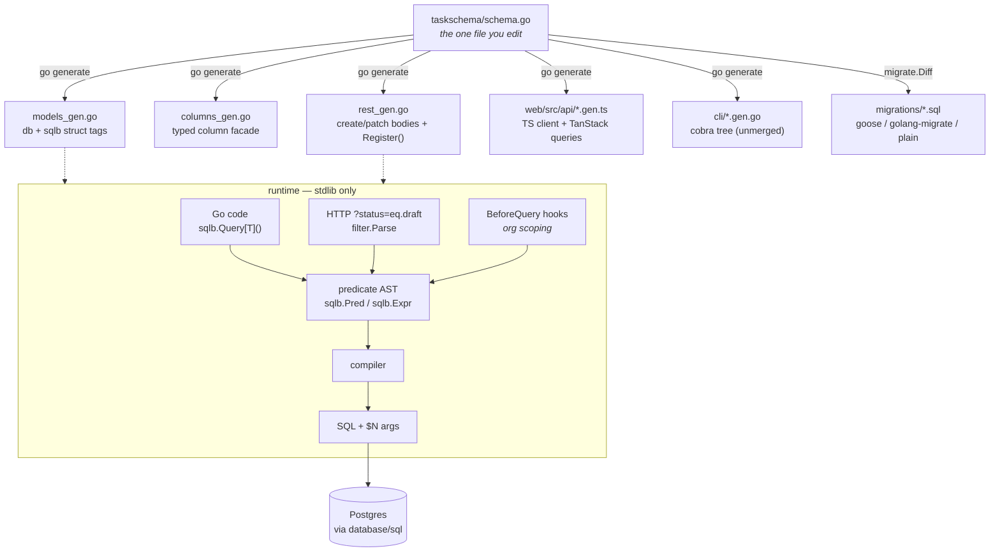
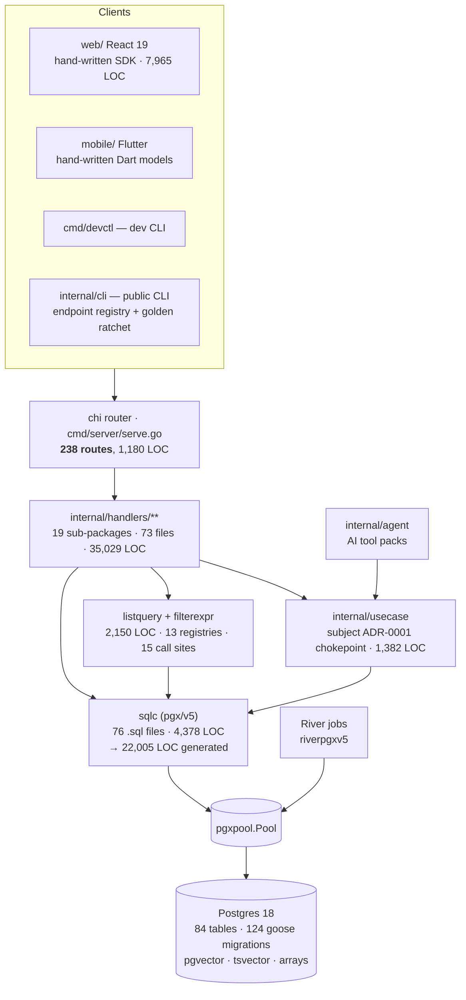
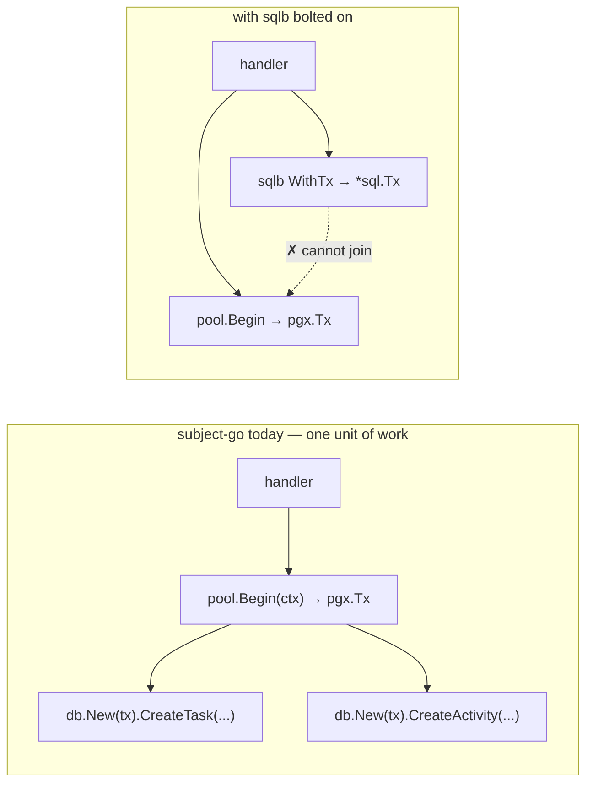
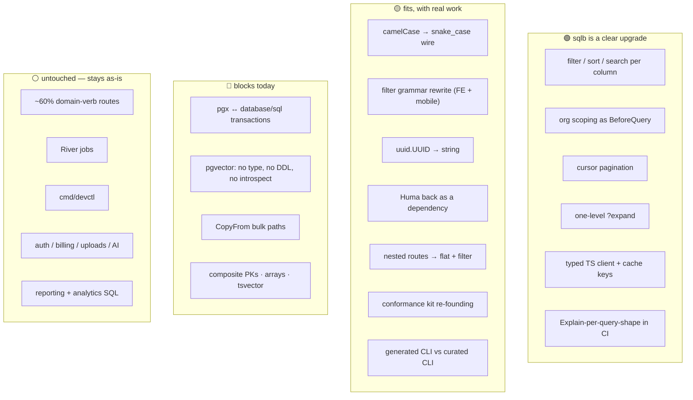
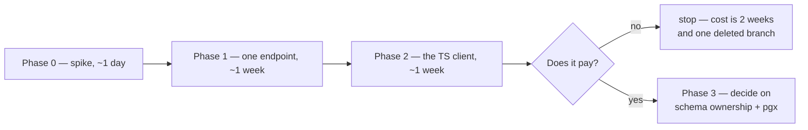
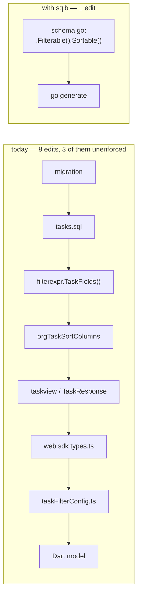
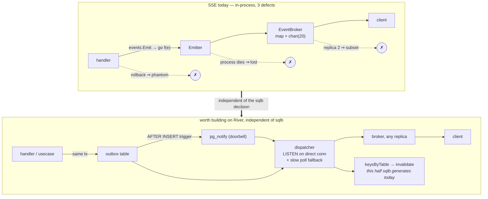
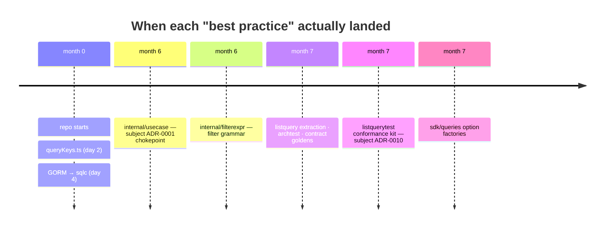
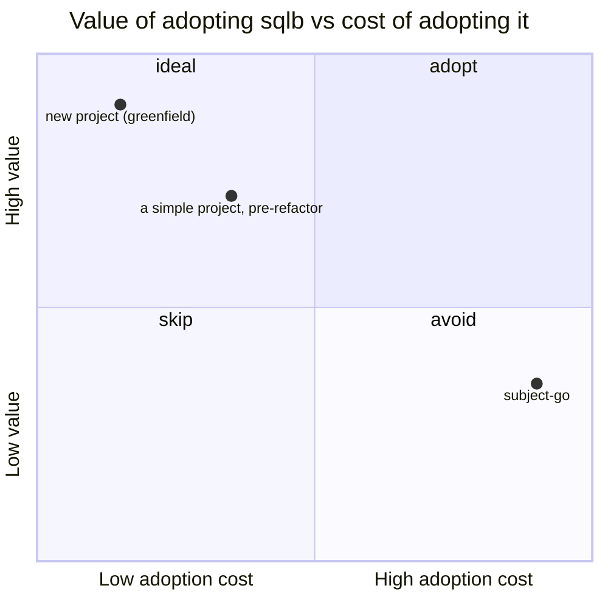

# Review — adopting sqlb into an existing codebase  (2026-07-29)

The first outside evaluation of sqlb against a real, seven-month-old
application — a multi-tenant product with 238 routes, 84 tables, a React web
client and a Flutter app in the field. The question asked was whether sqlb could
replace its CLI, REST and data layers, with backward compatibility explicitly
waived.

**The subject is anonymised.** It is called `subject-go` throughout, its
commits are labelled `R1`–`R4` and `F1`–`F3` rather than named by SHA, and its
timeline is given in months from the repository's first commit rather than in
dates. Nothing technical was removed: every count, every layer, every file path
inside the application and every finding is as written. What is gone is the
identity, because none of it is load-bearing — the shape of the codebase is what
the findings are about, and that shape is a common one.

Read it as a snapshot of one evaluator's judgement at `cc312aa` (branch
`feat/reverse-expansion`) plus the then-unmerged `bb63e12`, not as a verdict.
Where a finding names a file or a behaviour it was checked against the code;
where it is a judgement call, it says so. It is an evaluation, not a decision —
the input to one.

> **Two findings are already stale, and both moved in sqlb's favour.**
>
> - **§6.H — "the CLI emitter is unmerged."** `bb63e12` is on `main`
>   ([ADR-0029](adr/0029-go-cli.md)), so the confidence caveat no longer
>   describes it. The rest of that finding — a generated surface is a different
>   promise from a curated one — is untouched and is the stronger half.
> - **§11.3's second "less safe" item — the silently-default hook registry.**
>   [ADR-0030](adr/0030-declared-scope-is-required.md) landed: a table whose
>   schema declares its rows confined and whose model carries no scoping hook
>   now refuses to mount. What the review asked for as "a lint or an archtest
>   rule" is a startup failure. The `?expand` hole in **§6.F** is *not* closed —
>   ADR-0030 records it under Consequences — so the composite-key ordering
>   advice in §6.F, §9 and §11.3 stands unchanged.
>
> Findings **A** (`database/sql` vs pgx), **B** (no vector type), **D** (no type
> overrides) and the composite-PK, array and `tsvector` gaps in §6.B were
> re-checked against `main` on 2026-07-29 and all still hold.

**On ADR numbers.** subject-go keeps its own numbered ADRs, and the ranges
collide — its ADR-0007 reverts Huma, sqlb's specifies generated REST handlers.
Every reference below to one of subject-go's reads `subject ADR-000N`; a bare
`ADR-000N` is sqlb's own and links into [`adr/`](adr/).

---

## 1. Verdict in one page

**sqlb is a good architectural fit for roughly one-third of subject-go's REST
surface and a poor fit for the rest — and the thing that decides feasibility is
not the design, it is `database/sql`.**

The idea sqlb is built on (one predicate AST with two producers — Go code and a
URL grammar — so tenant scoping and bind-parameter discipline are enforced once)
is *the same idea* subject-go already implements in `internal/platform/filterexpr`
+ `internal/platform/listquery`. sqlb's version is strictly more capable:
capabilities are declared per column in one schema file, the same declaration
emits models, migrations, REST handlers, an OpenAPI document, a TypeScript
client and (unmerged) a cobra CLI, and `BeforeQuery` hooks make org-scoping
structural instead of per-call-site. That is a real upgrade over 13
hand-written registries and 15 hand-assembled `ListPage` call sites.

But three findings are load-bearing and none of them is about taste:

| # | Finding | Class |
|---|---|---|
| **A** | sqlb's `Executor` is `database/sql`. subject-go is pgx-native end-to-end (sqlc with `sql_package: pgx/v5`, `pgxpool.Pool` in every handler signature, `CopyFrom`, `pgvector` binary codec, River on `riverpgxv5`). **A sqlb write and a sqlc query cannot share a transaction.** | **Blocker for incremental adoption** |
| **B** | sqlb has **no `vector` type** — not in the schema DSL, not in `migrate`'s DDL, and `introspect` *refuses* a vector column. subject-go's RAG corpus is a `vector(1536)` column with an HNSW index. sqlb's own [ADR-0026](adr/0026-vectors-declare-their-index.md) is `Status: Exploring — nothing is built`. | **Blocker for schema ownership** |
| **C** | sqlb's `rest` package requires **Huma**. subject-go removed Huma deliberately in subject ADR-0007 after trying it on real domains. | **Reversal of a recorded decision** |

Add to that: pre-1.0, one author, **no observed consumers** — sqlb's own
[review](review-adoption-readiness.md) says the design
is not what holds it back, *the clock is*.

**Recommendation:** do not attempt a replacement of the CLI + REST + sqlc stack.
Do run a **bounded pilot** on one or two list-shaped resources (`qualifications`,
`time-entries`) using `sqlb.Describe[T]()` over the *existing* sqlc structs, on a
`database/sql` handle, with **no shared transaction** with sqlc. That tests the
part of sqlb that would actually pay for itself — the filter/sort/search/expand/
cursor surface and the hook-based tenant boundary — without touching pgx,
pgvector, migrations, or the wire format of anything mobile depends on. §8 has
the shape.

---

## 2. What sqlb is



Two properties carry the design:

1. **A query is a value** — predicates can be added on a branch, and a hook can
   amend a query it is handed.
2. **One AST, two producers** — the URL filter grammar and hand-written Go
   compile through the same path, so escaping, identifier validation and hooks
   happen exactly once.

Everything else follows: capabilities are opt-in per column (`Filterable`,
`Sortable`, `Searchable`, `Expandable`, `Hidden`), so exposing a table has a
blast radius legible from the schema file; rejections are 400s that name what
*would* have been accepted; `Explain` plans a query against the live schema
without running it (which catches more than a compile-time column check, because
it also fails on a migration that was written and never applied).

---

## 3. What subject-go is today



Numbers that matter for sizing:

| Thing | Count |
|---|---|
| Routes registered in `serve.go` | **238** (101 GET · 87 POST · 21 PATCH · 21 DELETE · 8 PUT) |
| Handler files / non-test LOC | 73 / **35,029** |
| Tables in migrations | **84** |
| Goose migrations | **124** |
| sqlc query files / LOC / generated LOC | 76 / 4,378 / **22,005** |
| Endpoints on the `listquery` conformance kit | **15** call sites, 13 registries |
| Web SDK (hand-written) | **7,965** LOC |
| CLIs | `internal/cli` 4,793 LOC + `cmd/devctl` 1,437 LOC |

**Roughly 40% of the route table is CRUD-shaped** (`GET /`, `POST /`,
`GET/PATCH/DELETE /{id}` across ~20 resources). The other ~60% is domain verbs
and non-table surfaces: `/{id}/complete`, `/{id}/block`, `/{id}/reorder`,
`/{id}/duplicate`, `/bulk-assign`, `/{id}/ask`, `/{id}/chunks`,
`/{id}/datasheet/extract`, `/clock-in`, `/billing/webhook`, `/auth/2fa/*`,
`/upload`, `/{id}/export`, the whole superadmin plane, dashboards and analytics
rollups. **sqlb has nothing to say about any of those, by design** — and that is
fine, they stay hand-written on the same chi router.

---

## 4. Layer-by-layer fit

| Layer | subject-go today | sqlb equivalent | Fit |
|---|---|---|---|
| Schema source of truth | 124 goose SQL migrations + `sqlc.yaml` | `schema.Table(...)` Go DSL → `migrate.Diff` → goose files | 🟡 Adoptable via `introspect` — **except vector/tsvector/array columns** |
| Typed data access | sqlc, 76 `.sql` files, pgx | `sqlb.Query[T]()` + typed column facade | 🟡 Good for CRUD/list; reporting stays on sqlc |
| Dynamic list surface | `filterexpr` + `listquery` (13 registries) | `filter` + capabilities | 🟢 **Direct upgrade.** Same idea, more of it |
| Tenant scoping | `WHERE org_id = $n` in every query; `archtest/sql_org_scope_test.go` | `BeforeQuery` hook, one registration per model | 🟢 **Strictly better** — structural, not conventional |
| Authorization above the query | `internal/usecase` + `middleware.IsAdmin/IsOwner` (subject ADR-0001, subject ADR-0009) | Nothing. sqlb's non-goal | 🟢 Compatible — usecase sits *above* sqlb |
| REST plumbing | 73 handler files on chi | `rest.Resource[T,C,U]` on a `huma.API` | 🔴 **Requires Huma** (subject ADR-0007 removed it) |
| API contract | golden contract tests (`AssertContractGolden`) | OpenAPI from the model + generated TS/CLI | 🟡 Trade: gain a real spec, lose the golden mechanism's coverage story |
| Web client | hand-written SDK + `queryKeys.ts` + 4 arch tests | generated `client.gen.ts` + `queries.gen.ts` | 🟢 **Genuinely attractive** — but snake_case and a full SDK rewrite |
| Public CLI | curated cobra commands + `endpoints` registry + contract-golden ratchet | generated cobra tree ([ADR-0029](adr/0029-go-cli.md), **unmerged**) | 🟡 Gains completeness, loses the curated surface and the ratchet |
| Dev CLI (`devctl`) | raw passthrough + profiles + agent/SSE | not addressed by sqlb at all | ⚪ Out of scope — keep |
| Jobs (River) | `riverpgxv5` on the same pool | none | ⚪ Unaffected — but see finding A |
| RAG / pgvector | `vector(1536)`, HNSW, `CopyFrom` bulk insert | **none** | 🔴 **Blocker** |

Legend: 🟢 fits · 🟡 fits with work · 🔴 blocks · ⚪ out of scope

---

## 5. What fits well

These are the reasons this evaluation is worth doing at all.

### 5.1 The list surface is the same idea, better executed

subject-go's `listquery.Spec` already separates **scope** (identity-derived,
always applies) from **filter** (client-supplied, can only narrow) — which is
exactly subject ADR-0010's rule and exactly what sqlb's `BeforeQuery`-plus-capabilities
split does. The difference is where the declaration lives:

```go
// subject-go today — internal/platform/filterexpr/registry.go, ×13
func TaskFields() Registry {
    return Registry{
        "status": {Column: "status", Type: TypeEnum, EnumValues: [...],
                   Operators: ops(OpEq, OpNeq, OpIn, OpNotIn)},
        ...
    }
}
// plus: Sortable map, SearchColumns, DefaultOrder, TieBreak — in the handler
// plus: a listquerytest.Run contract test, per endpoint
// plus: an entry in AllRegistries() or it ships unchecked
```

```go
// sqlb — one line, in the schema, and it is also the DDL and the TS type
schema.Enum("status", "todo", "in_progress", "blocked", "done").Filterable().Sortable(),
```

That collapses four hand-maintained artefacts into one. It also removes the
class of bug subject ADR-0010 and `TestListAndCountTwinsAgree` exist to catch: sqlb has
no `Count<X>` twin to drift, because `?count=exact` is a second query over the
*same* compiled WHERE.

### 5.2 Tenant scoping becomes structural

Today: every `.sql` file carries `AND org_id = $n`, and
`internal/archtest/sql_org_scope_test.go` plus the `*_admin.sql` naming
convention are what keep it honest. That is a *convention enforced by a test*.

With sqlb it is a mechanism:

```go
sqlb.On[Task]().BeforeQuery(func(ctx context.Context, q *sqlb.Builder[Task]) error {
    org, ok := middleware.GetOrgID(ctx)
    if !ok { return ErrNoTenant }          // fails closed — no SQL is issued
    q.Where(sqlb.F("org_id").Eq(org))
    return nil
})
```

One registration constrains every read of the model, including reads issued by
generated handlers. And the superadmin plane — which by
subject ADR-0009 has *no* `orgID` — maps
cleanly onto sqlb's scoped registries: `sqlb.New(pool).WithHooks(emptyRegistry)`
gives a second handle whose queries are unscoped, and it is a *value* rather
than a "skip the hooks" flag a caller could pass. That is a better shape than
`*_admin.sql` files, which rely on a filename convention.

### 5.3 The TypeScript client is the single biggest concrete win

`web/src/sdk` is 7,965 hand-written lines whose only guarantee that a filter
parameter is legal is that someone typed it correctly. sqlb generates a client
where `where` admits only filterable columns, the operator set is narrowed by
column type, `select` narrows the *response* type, hidden columns have no
spelling at all, and TanStack `queryOptions` + a cache-key factory come with it.
subject-go's `queryKeys.arch.test.ts` enforces four rules by hand that a
generator makes unnecessary.

### 5.4 Cursor pagination, for free

subject-go's `PaginatedResponse` has a `Cursor` field that no list endpoint
populates — everything is `limit`/`offset`. sqlb's `?cursor=` is keyset paging
with `next_cursor` on every response that has a next page, so adoption needs no
flag. For the mobile sync path and any export, that is a real correctness
improvement (offset paging repeats or skips rows when the table is written to
mid-walk).

### 5.5 `?expand` covers the "WithRelations" queries

`ListTasksWithRelationsByIDs` and its siblings exist to attach assignee/project/
work-package names to a list row. sqlb's forward `?expand` is one `LEFT JOIN`
plus `json_build_object` in the same statement — same snapshot, no N+1, and it
is wired by codegen. One level is enough for every relation subject-go currently
denormalises.

### 5.6 The escape hatches are where they need to be

- `rest` takes a `huma.API`, not a router — chi and all its middleware stay.
- `Executor` is two methods — tracing/instrumentation wrappers work unchanged.
- Hand-written endpoints mount on the same router (`example/tasks` has six
  generated resources and six hand-written endpoints side by side).
- Migrations are *files*; the runner stays goose.
- `Raw`/`RawPred` for what the builder can't model; `Collect[R]` for aggregates.

So the ~60% of subject-go's routes that are domain verbs do not have to move.

---

## 6. Friction, ordered by severity

### 🔴 A. `database/sql` vs pgx — the transaction interop wall

This is the finding that decides feasibility, and it is not a preference.



- sqlb's `Executor` is frozen at `QueryContext`/`ExecContext` from
  `database/sql` — sqlb's own compatibility doc lists it under **Frozen**, and
  says it will only ever grow by optional interfaces, never by methods.
- subject-go's sqlc is generated with `sql_package: pgx/v5`, so `db.DBTX` is
  `Exec/Query/QueryRow/CopyFrom` over `pgconn`/`pgx` types. `Queries.WithTx`
  takes a `pgx.Tx`.
- sqlb's documented interop hatch is `DB.Tx() (*sql.Tx, bool)` — which works for
  sqlc generated in `database/sql` mode. It does **not** produce a `pgx.Tx`.

A `*sql.DB` over the same pool is available (`stdlib.OpenDBFromPool`), so both
can share *connections*. They cannot share a *transaction*. Every handler that
today wraps two writes in `pool.Begin` (25 sites, e.g.
`internal/handlers/core/tasks_reorder.go:98`,
`internal/handlers/identity/auth.go:209`) would have to be entirely on one side
or the other.

Escaping this means regenerating sqlc in `database/sql` mode, which costs:

- **`CopyFrom` disappears.** sqlc only emits it for pgx. Three bulk paths use it
  — `CreateDocumentChunks` (the RAG ingest hot path, with binary-encoded
  vectors), `CreateDatasetRows`, `CreateNotifications` — and would become
  multi-row `INSERT`s.
- **pgvector binary codec goes.** `internal/platform/db/conn.go:106` registers
  the pgvector type on the pgx connection specifically so `CopyFrom` can use the
  binary protocol. `database/sql` falls back to text.
- **River is unaffected** (it holds its own `riverpgxv5` pool via
  `DATABASE_URL_DIRECT`), but it means the process now runs pgxpool *and*
  `database/sql`, which is a connection-accounting change worth measuring behind
  PgBouncer.

**Assessment:** the only clean shapes are (i) sqlb owns a *disjoint set* of
tables and never shares a transaction with sqlc, or (ii) a full migration of
sqlc to `database/sql` — which is a large, risky change made for a pre-1.0
dependency. (i) is the pilot in §8. (ii) is not recommended.

### 🔴 B. pgvector is not expressible

From sqlb's own [ADR-0026](adr/0026-vectors-declare-their-index.md) (`Status: Exploring — nothing is built`):

- `migrate.sqlType` ends in `unknown type %q` — **no vector declaration
  renders**, not even via the `OfType` escape hatch external refs use.
- `migrate.createIndex` has no operator class and no `WITH`, so `USING hnsw`
  renders and means nothing.
- `introspect` **refuses** a vector column with a diagnostic — so adopting
  subject-go's database produces a `schema.go` with `document_chunks.embedding`
  missing.

subject-go has `vector(1536)` on `document_chunks`, an HNSW index, and
`ORDER BY embedding <-> $1` queries. sqlb's ADR names this precisely as the case
where the "keep sqlc for reporting" split *breaks* — because a vector is a
column, not a query shape, and sqlb claims the schema.

**Consequence:** sqlb cannot own the schema while pgvector is in it. Either the
RAG tables stay outside the sqlb registry entirely (and the schema has two
sources of truth, which is the failure ADR-0026 describes), or vector support
lands in sqlb first.

Also unexpressible today: `TEXT[]` / `VARCHAR(n)[]` (4 columns), `tsvector`
(4 references), `BIGSERIAL`, `INTERVAL`, and composite primary keys —
`schema.Validate` reports `"%d primary keys declared, expected at most one"`,
and 4 tables in `migrations/` declare one.

### 🔴 C. `rest` requires Huma — a recorded reversal

subject ADR-0007 removed Huma after
trying it on `qualifications` plus a tasks/projects/members spike, on the
finding that "`huma.Register(...)` operation blocks + `XxxInput{Body …}` wrapper
structs make handlers read *worse* than plain chi".

The nuance in sqlb's favour: **you would not write those blocks.**
`rest.Resource[T,C,U]` is one generic function, and codegen emits the
registration. Huma becomes a dependency, not a handler style — the ergonomic
complaint that motivated subject ADR-0007 mostly does not apply. But:

- Huma returns as a direct dependency, and mounting it means `humachi.New(...)`
  wrapping the existing chi router, with two error-response conventions in one
  API (Huma's RFC-7807 `{title,status,detail,errors}` vs
  `utils.BadRequest`'s shape) unless one is normalised.
- Reversing subject ADR-0007 requires a new superseding ADR. That is process, not
  blockage, but it should be a conscious act — the reasoning in that record about
  *agents keeping unenforced parallel artefacts in sync* still holds, and is
  actually an argument *for* sqlb (the artefact stops being parallel).
- subject ADR-0007's replacement mechanism — golden contract tests — would be
  substantially obsoleted for generated resources (their shape is derived), but
  still needed for the ~60% of hand-written routes.

### 🟡 D. Type mapping is fixed and narrow

`schema.Type.GoType()` is a closed switch with **no override mechanism**:

| Schema type | sqlb Go type | subject-go today |
|---|---|---|
| `uuid` | `string` | `github.com/google/uuid.UUID` |
| `jsonb` | `json.RawMessage` | `json.RawMessage` ✓ |
| `numeric`/`decimal` | `float64` | `pgtype.Numeric` / `float64` |
| `int` | `int32` | `int32` ✓ |
| `vector` | — | `pgvector.Vector` |
| `text[]` | — | `[]string` |

`uuid → string` alone touches everything: `middleware.GetOrgID` returns
`uuid.UUID`, all 13 filter registries type ids as `TypeUUID`, `listquery`
returns `[]uuid.UUID`, and `internal/usecase` signatures are uuid-typed. sqlc's
`overrides:` block in `sqlc.yaml` has no counterpart in `codegen.Options`.

`sqlb.Describe[T]()` sidesteps this for the *pilot* — it layers capabilities
onto structs sqlc already generated, with their existing types — which is
exactly why the pilot in §8 uses `Describe` rather than the schema DSL.

### 🟡 E. Wire format: three simultaneous breaks

Backward compatibility is waived, so these are *cost*, not blockers. But they
land together on both clients.

| | subject-go | sqlb |
|---|---|---|
| Field naming | `camelCase` (`workPackageId`, `orgId`, `hasMore`) | `snake_case` — `jsonTag` emits the **column name** verbatim |
| List envelope | `{data, total, cursor, hasMore}` | `{items, page, per_page, has_more, next_cursor, total?}` |
| Filter grammar | `?filter=<JSON expression tree>` (`filterexpr`, MaxDepth 3, MaxNodes 32) | `?status=eq.draft&or=(a.eq.1,b.lt.2)` PostgREST-style, **frozen** in sqlb v0.1.0 |
| Sort | `?sort=x&sortDir=asc` | `?sort=-x,y` |
| Paging | `?limit&offset` | `?page&per_page` or `?cursor` |
| Nested collections | `GET /projects/{id}/tasks` | `GET /tasks?project_id=eq.{id}` — `Options.Path` is a flat collection path; **there is no parent-scoped route form** |

The frontend cost is concrete: `web/src/components/filter-bar/`,
`web/src/components/data-view/FilterControl.tsx`, `filterPresets.ts`,
`taskFilterConfig.ts` all build the JSON tree and would be rewritten against the
generated client's `where` object. The 10 hand-written Dart model files in
`mobile/lib/**/data/` would need regenerating by hand (sqlb emits no Dart).

### 🟡 F. Hooks do not follow an expansion — a real tenant-leak edge

sqlb documents this explicitly: a `BeforeQuery` hook on the *target* model does
**not** run for `?expand`, because the target arrives as a joined subexpression.
`example/tasks` compensates with **composite foreign keys** keeping a task and
its list in the same workspace.

subject-go currently has no such composite FKs — org scoping is a predicate, not
a constraint. So enabling `?expand` on, say, `task → project` without first
adding `(id, org_id)` composite keys would make expansion a path that skips the
org predicate. This is fixable (it is a migration), but it must be done *before*
`Expandable()` is declared, not after.

Related: `?expand` also does not compose with subject-go's `backoffice_only`
document visibility (subject ADR-0009's worker-type axis), which today is a handler-level
check.

### 🟡 G. The conformance kit and archtest suite need re-founding

Adopting sqlb for a resource retires, for that resource:

- its `filterexpr` registry and the two gate tests
  (`TestRegistriesAreWellFormed`, `TestRegistryNullableMatchesSchema`),
- its `listquerytest.Run` contract test,
- its share of `TestListAndCountTwinsAgree` and `sql_org_scope_test.go`.

Those tests encode hard-won rules (paging is a partition; no filter escapes
Scope; complementary operators partition it; wildcards are literal). sqlb makes
most of them structurally true rather than tested — but *during* a hybrid period
both mechanisms exist, and `internal/archtest`'s rules would fire on the sqlb
half. `route_reachability_test.go` and `cli_contract_test.go` in particular
assume the chi route table is the whole surface.

### 🟡 H. The CLI story is half-built and points a different direction

- There is **no `sqlb` binary**. Codegen and migrations are Go programs *you*
  write (`example/tasks/cmd/gen`, `cmd/migrate`). sqlb's README lists "a
  command-line entry point" under *not built yet*. That is fine — subject-go
  already has `mise` tasks — but it means no `sqlb generate` / `sqlb migrate`.
- The **generated app CLI** (cobra, [ADR-0029](adr/0029-go-cli.md)) is real code — 1,402 LOC in
  `codegen/gocli.go` + `gocli_runtime.go` — but sits on the unmerged branch
  `claude/github-pr-review-f6de0c` @ `bb63e12`, marked `Confidence: Medium on
  the shape … Low on --all and on the enum completions`.
- Its philosophy conflicts with `internal/cli`'s. subject-go's public CLI
  deliberately ships **no raw passthrough** and binds only to endpoints declared
  in `internal/cli/endpoints`, each of which must name a contract golden or
  record its debt — a ratchet enforced by
  `TestPublicEndpointsHaveContractGoldens`. A generated CLI exposes *every*
  exposed resource by construction, which is the opposite promise. Adopting it
  means deciding that "the schema decides the CLI surface" replaces "a human
  decides the CLI surface, and a test proves each is pinned".
- `cmd/devctl` (dev CLI: profiles, token refresh, agent SSE, superadmin plane) is
  untouched by any of this and should stay as-is.

### 🟡 I. Migration adoption is a closed loop with two hand-cranks

`introspect.Registry` → `codegen.RenderSchema` gives a `schema.go` from the live
database, and `shadow.Build` replays the 124 goose migrations into a scratch DB
so the *history* (not production) is the current side of a diff. That is a
genuinely good adoption story. Two caveats for subject-go specifically:

- Everything imports with **no capabilities and nothing exposed** — correct
  default, but it means 84 tables × per-column capability decisions by hand.
- `introspect` reports what the DSL cannot express; for subject-go that report
  will contain the vector column, the arrays, the tsvector columns, the 14
  trigger functions, the 4 composite PKs and the 10 partial indexes. Until it is
  empty, "the schema does not describe the database completely" — and
  `migrate.Diff` against an incomplete target proposes drops.

### 🟡 J. Maturity

Stated plainly because sqlb states it plainly: pre-1.0, one author, **no
observed consumers**, `v0.1.0` tagged 2026-07-27. Its own adoption review's
answer to "what would change the verdict" is *"six months of someone other than
the author running it against production traffic."* subject-go is a multi-tenant
product with an un-updatable Flutter client in the field. Being the first
consumer is a decision to take on the discovery cost, and it should be taken
deliberately and in a small blast radius.

Mitigating: the engine has **zero third-party dependencies** (CI-enforced per
package), CI applies generated DDL to real Postgres 18 and requires the
introspect round-trip to be a fixpoint, and the query path runs through a real
PgBouncer in transaction pooling — which is subject-go's deployed topology.

---

## 7. Fit map



---

## 8. If you want to try it — the smallest honest experiment

The goal of a pilot is to learn whether the *list surface plus hooks* pays for
itself, without touching pgx, pgvector, migrations, or any client contract that
matters. That means: **`Describe`, not the schema DSL. Read-only. Disjoint
tables. No shared transaction.**



**Phase 0 — spike (1 day).** In a worktree:
`stdlib.OpenDBFromPool(pool)` → `sqlb.New(db)`. Point `sqlb.Describe[db.Qualification]()`
at the sqlc-generated struct (sqlb's snake_case fallback already covers sqlc's
naming — `OrgID → org_id` — which `example/withsqlc` proves against real sqlc
v1.31.1 output). Register a `BeforeQuery` org hook. Run
`sqlb.Explain(ctx, db, q)` against a test database for every shape the existing
`qualifications` list endpoint can produce. **Success criterion:** every shape
plans, and the org predicate is present in every plan.

**Phase 1 — one endpoint behind a flag (≈1 week).** Mount `rest.Resource` for
`qualifications` (read + list only, `Ops: OpRead | OpList`) at `/api/v2/qualifications`
on a `humachi` API over the *existing* chi router. Keep the v1 handler live.
Port that endpoint's `listquerytest.Run` assertions to hit v2. **Watch for:**
Huma error-shape divergence, the snake_case response, and whether
`DisableTransactions` matters at all on a read path.

**Phase 2 — the client (≈1 week).** Generate `client.gen.ts` for that one
resource into `web/src/api/`, wire it to the existing transport, and rebuild one
screen's filter bar against the typed `where`. **This is the phase that produces
the actual answer**, because the TS client is the largest single win and the
filter-grammar rewrite is the largest single cost — measuring them against each
other on one real screen is worth more than any amount of further reading.

**Phase 3 — only if Phases 0–2 land well.** The two open questions are then
strategic, not exploratory: (a) is it worth migrating sqlc to `database/sql` to
unlock shared transactions, and (b) does pgvector support land in sqlb (its
ADR-0026 is a design, not a plan) or do the RAG tables stay permanently outside
the registry. Both deserve their own ADRs in this repo.

**Do not, in a pilot:** let sqlb own any migration, declare `Expandable()` before
composite `(id, org_id)` FKs exist, put a write path on sqlb, or touch anything
the Flutter app reads.

---

## 9. What would have to change, on each side

### In sqlb, before a *full* adoption is even discussable

1. **pgvector** — column type, DDL with operator class + `WITH`, index method,
   and `introspect` support. Its ADR-0026 is at `Confidence: Low`, unbuilt.
2. **A pgx path**, or an accepted permanent split. Realistically: an optional
   interface sqlb type-asserts for (its compatibility doc says `Executor` grows
   "by adding optional interfaces that are type-asserted for") that lets a
   caller supply a pgx-backed executor and join a `pgx.Tx`.
3. **Type overrides in `codegen.Options`** — the sqlc `overrides:` equivalent.
   Minimum: `uuid → uuid.UUID`.
4. **Array columns**, `tsvector`, and either composite PKs or a documented
   position that composite-PK tables stay outside the registry.
5. **A JSON naming policy** (`json:` tag casing) that is not "the column name".
6. **The CLI emitter merged**, and a position on curated-vs-generated surfaces.

### In subject-go, before adopting even the list surface

1. A superseding ADR for subject ADR-0007
   if `rest` is mounted — Huma returns as a dependency.
2. Composite `(id, org_id)` foreign keys on every parent/child pair that would
   ever be `Expandable`, **before** the capability is declared (§6.F).
3. A decision on the wire format: snake_case + `{items,…}` + PostgREST filter
   grammar means a coordinated web + Flutter release. Backward compat is waived,
   but the *cutover* still has to be sequenced.
4. A plan for `internal/archtest` during the hybrid period — its route/CLI/SQL
   rules assume one path.
5. A position on the public CLI: schema-generated surface, or the curated
   `endpoints` registry with its golden ratchet. They are different promises.

---

## 10. Bottom line

sqlb is well-designed, unusually well-documented, and solves a problem
subject-go genuinely has — it has already built two-thirds of the same answer by
hand (`filterexpr` + `listquery`), and sqlb's version is the more complete one.
If subject-go were greenfield on Postgres 18 with no pgvector and no shipped
clients, this would be a straightforward yes for the CRUD and list surface.

It is not greenfield. The stack is pgx-native by deliberate choice
(subject ADR-0003), the RAG corpus is pgvector, Huma
was removed on evidence (subject ADR-0007),
and roughly 60% of the route table is domain verbs sqlb explicitly does not
address. A wholesale replacement of the CLI + REST + sqlc layers is not feasible
today, and would not be a good trade even if it were, because the dependency it
would trade *into* has no consumers yet.

The honest framing is sqlb's own: it is not "sqlb **or** sqlc" — it is "sqlb for
the dynamic list-and-CRUD surface, sqlc for everything typed and everything
reporting". subject-go could reach that end state. The path runs through the
pgx/`database/sql` question first, and the cheapest way to learn whether the
destination is worth the walk is the two-week pilot in §8.

---

## 11. Addendum — how much code, how much faster, how much safer, and SSE

*Added 2026-07-29 in answer to three follow-up questions.*

### 11.1 How much of our own code goes away

Counted per surface, not estimated. "Deleted" means the code has no successor we
maintain; "relocated" means it survives in a different shape and is not a saving.

**Deleted with confidence — the list surface**

| Surface | LOC | Successor |
|---|---:|---|
| 13 `List*` handler functions | **2,052** | `rest.Resource` + `filter.Apply` |
| `internal/platform/filterexpr` (non-test) | **1,090** | column capabilities in the schema |
| `internal/platform/listquery` (non-test) | **230** | the builder |
| `internal/platform/listquerytest` kit | **660** | structurally true, not tested |
| `*/list_contract_test.go` | **1,288** | ″ |
| `*_filter_test.go` / `*_list_test.go` | **1,269** | ″ |
| **Go subtotal** | **6,589** | |
| `web/src/sdk` services + types (non-test) | **5,175** | `client.gen.ts` + `queries.gen.ts` |
| **Total hand-maintained code retired** | **≈11,800** | |

Add the four `queryKeys.arch.test.ts` rules, which a key factory makes moot, and
this endpoint's share of `archtest`'s `sql_list_count_test.go` and
`sql_org_scope_test.go`.

**Relocated, not deleted — the single-row surface**

The `Get`/`Create`/`Update`/`Delete` functions across those same 13 files are
**4,351 LOC**. Perhaps a third of that is plumbing sqlb absorbs (decode, parse
id, org check, respond); the rest is domain logic — status transitions,
geocoding, activity emission, billing limits — which moves into
`BeforeCreate`/`BeforeUpdate` hooks or into `internal/usecase`. Call it **~1,400
deleted, ~2,950 moved**. Moving it is arguably an improvement (it becomes
unskippable by the agent path, which is subject ADR-0001's whole point), but it is not a
line count you get back.

**Not a saving at all**

- 22,005 LOC of sqlc-generated Go is replaced by sqlb-generated Go. Generated
  code you do not read is not a cost, so this nets to zero.
- The 667 LOC of frontend filter builder (`filter-bar/`, `FilterControl.tsx`,
  `filterPresets.ts`, `taskFilterConfig.ts`) is **rewritten**, not removed.

**Added**

| | LOC |
|---|---:|
| Schema DSL for ~20 exposed tables (`example/tasks` is 6 tables in ~250 lines) | ~700–900 |
| The remaining 64 tables, if sqlb owns the schema (via `introspect`, then curated) | ~1,800 |
| Hooks — org scope, soft delete, worker type, superadmin registry (`example/tasks` is ~200 lines for 6 models / 25 endpoints) | ~400–600 |
| `Explain`-per-shape tests | ~300 |

**Net: about 6,000–7,000 lines of hand-maintained Go and ~5,000 lines of
hand-written TypeScript stop existing**, against ~1,500–3,500 lines added. That
is roughly **20% of the 35,029-line handler layer**, and it is deliberately the
least novel 20% — the part that is retyped per resource and is where the
security bugs hide.

It is *not* the 60% of the route table that is domain verbs, uploads, auth,
billing, AI and analytics. Those numbers do not move.

### 11.2 Faster?

**Yes, on the one axis that is measurable.** Adding a filterable, sortable
column to tasks today touches eight places:



Three of today's eight (the SDK type, the filter config, the Dart model) are
*unenforced parallel artefacts* — precisely the failure mode
subject ADR-0007 named as the reason
to put contract truth in a test, and precisely what agents are worst at keeping
in sync. sqlb removes the parallelism rather than testing it.

**But slower on three axes, and two of them are not temporary:**

- **The hybrid period is genuinely slower.** Two filter grammars, two list
  paths, two client shapes, and `archtest` rules that assume one of each. subject ADR-0010
  exists because *"a second path is the half that tests don't cover and the web
  app does hit"* — a sqlb migration deliberately creates that second path and
  lives with it for however long the rollout takes.
- **Anything transactional across the sqlb/sqlc line gets harder, permanently**,
  until the pgx question in §6.A is resolved. That is not a rollout cost, it is
  the steady state of a hybrid.
- **You would be debugging sqlb, not just using it.** No consumers means the
  bugs are unfound. Budget for upstreaming.

Net: **faster per schema change, slower per release, for at least two quarters.**

### 11.3 Safer?

Genuinely safer in four places, and *less* safe in three. Both lists matter.

**Safer**

1. **Tenant scoping becomes a mechanism, not a convention.** Today it is
   `AND org_id = $n` in 76 `.sql` files, policed by `sql_org_scope_test.go` and
   the `*_admin.sql` naming rule. With `BeforeQuery` a missing tenant is
   `return ErrNoTenant` and **no SQL is issued** — fails closed rather than
   returning the whole table. This is the single strongest argument in sqlb's
   favour, and it is worth more than the line count.
2. **`Hidden` has no equivalent today.** subject-go keeps `password_hash`,
   `totp_secret` and friends out of responses via hand-written response structs.
   sqlb makes a hidden column absent from the projection, the filter vocabulary,
   the OpenAPI schema, the rejection allow-list, *and* the `json` tag — so a
   stray `json.Marshal` in a debug log cannot leak it either.
3. **Capabilities and DDL are the same declaration**, so they cannot drift.
   Today `TestRegistryNullableMatchesSchema` exists because a `Nullable` flag in
   `filterexpr` had already drifted from `information_schema`.
4. **`Explain` in CI catches an unapplied migration.** Given how often
   out-of-order goose migrations bite this repo (there is a whole CLAUDE.md
   section on it), a test that plans every query shape against the live schema is
   directly useful.

**Less safe**

1. **`?expand` does not run the target's hooks.** sqlb documents this and its own
   example compensates with composite foreign keys. subject-go has none — org scoping
   is a predicate, not a constraint. Declaring `Expandable()` before adding
   `(id, org_id)` composite FKs would create a read path that skips the org
   predicate. **This is the one finding that could produce a cross-tenant leak,
   and the ordering is not optional.**
2. **Which hook registry runs is decided by the *dynamic type* of the executor.**
   sqlb's own compatibility note: passing a raw `*sql.DB` where a scoped
   `*sqlb.DB` was meant *silently uses the default registry*. In subject-go that maps
   exactly onto the superadmin plane — the boundary where a silent fallback is
   least acceptable. It needs a lint or an archtest rule, not care.
3. **First-consumer risk on a security-relevant path.** The filter compiler and
   the projection logic decide what a tenant can read. They are well-argued and
   well-tested, by one author, with no production traffic behind them.

Net: **safer on the boundary that is currently held by convention, riskier on
two new foot-guns and on novelty.** The trade is favourable *if* the composite
FKs land first and the registry-selection foot-gun gets a test.

### 11.4 SSE

Short answer: **sqlb does not touch SSE today, does not help it, and does not
hurt it. But the interaction is more interesting than "no", in both directions.**

**What subject-go has now**

| Piece | LOC | Shape |
|---|---:|---|
| `internal/handlers/events.go` | 91 | SSE endpoint + short-lived SSE token |
| `internal/notifications/broker.go` | 153 | in-memory `map[memberID]→chan`, buffered 20 |
| `internal/notifications/event_listener.go` | 298 | turns domain events into notifications |
| `internal/platform/events` | 306 | in-process typed emitter, `go handler(event)` |
| `internal/handlers/assistant/agent_chat.go` | 774 | LLM token streaming — a different thing entirely |
| `web/src/hooks/useSSE.ts` + `useAgentStream.ts` | 450 | consumers |
| `internal/cli/client/stream.go` | 97 | CLI consumer |

Two things follow from reading it. First, **subject-go's SSE is a notification
channel, not a change feed** — the event vocabulary is `chat_message` and
`notification`, addressed to a member, not "table X row Y changed, refetch".
Second, **the bus is entirely in-process**: `Emitter.Emit` spawns
`go handler(event)` and `EventBroker` is a `sync.RWMutex` around a map.

That gives it exactly the three defects sqlb's [ADR-0012](adr/0012-change-feed-outbox.md) opens by naming, plus one
it does not:

- **Phantom events.** `events.Emit` is called from the handler, not after commit.
  A transaction that rolls back after the emit has already told the client.
- **Lost events.** In-process and fire-and-forget; a process death between emit
  and delivery leaves no trace. The subscriber channel is buffered at 20 and
  drops beyond it.
- **Single replica.** There is no `LISTEN/NOTIFY` fan-out, so a second app
  container serves SSE only to the clients connected to *it*. Anything
  horizontally scaled silently delivers a subset.

**What sqlb offers today: one useful half, and it is the client half**

sqlb's change feed is **not built** — ADR-0012 is `Status: Exploring,
Confidence: Low`, and the README lists "a durable change feed" first under *not
built yet*. `AfterCommit` exists and is explicitly *not* it: in-process,
at-most-once, "a callback that never ran because the process died leaves no
trace." That is the same guarantee subject-go already has, so adopting it is lateral
— **except** that it fires *after commit* rather than before, which fixes the
phantom-event defect for any write going through sqlb.

The genuinely useful half is on the client. sqlb's generated TypeScript emits a
cache-key factory **plus a `keysByTable` index**, built for exactly this:

```ts
keysByTable['tasks'].lists();   // reached from an event payload, mechanically
```

sqlb's own vision doc argues the feed is *worth less than the key factory it
needs*, because otherwise every consumer hand-writes an invalidation list that
drifts from the one its mutations use. subject-go has that drift risk today —
`queryKeys.ts` is maintained by hand and policed by four arch tests, and
`useSSE.ts` feeds it. So the one SSE-adjacent thing sqlb ships **now** is the
piece that makes a table+row-key event mappable to cache keys without a second
hand-maintained list.

**Recommendation on SSE specifically**

Do **not** wait for sqlb's outbox, and do not treat it as part of this decision.
subject-go is better positioned to build it than sqlb is:

- The outbox pattern ADR-0012 describes (write the event in the same transaction,
  `AFTER INSERT` trigger rings `pg_notify`, dispatcher tails the table with a slow
  poll fallback) is ~200 lines here, and **River is already running** on a direct
  connection (`DATABASE_URL_DIRECT`, provisioned precisely because PgBouncer
  swallows `LISTEN/NOTIFY`). The infrastructure sqlb's design needs already exists
  in this repo; sqlb's does not.
- Doing it on River fixes all three defects — durability, at-least-once, and
  multi-replica fan-out — and is worth doing **whether or not sqlb is ever
  adopted**. It is the higher-value change of the two.
- `agent_chat.go`'s 774 lines are LLM token streaming. Nothing in sqlb, now or
  in any roadmap item, addresses that. It stays exactly as it is.



### 11.5 Summary of the three answers

| Question | Answer |
|---|---|
| **How much code?** | ~6,600 LOC of Go and ~5,200 LOC of TS retired; ~1,400 more deleted and ~2,950 relocated on the single-row surface; ~1,500–3,500 added. **≈20% of the handler layer, and the least novel 20%.** |
| **Faster?** | Per schema change, decisively — 8 edits become 1, and 3 of the 8 are today unenforced. Per release, slower for ≥2 quarters, and permanently slower for anything transactional spanning sqlb and sqlc. |
| **Safer?** | Yes on the tenant boundary (mechanism replaces convention) and on hidden columns. **No** until composite `(id, org_id)` FKs exist — `?expand` skips the target's hooks. Plus a silent-default-registry foot-gun on the superadmin plane, and first-consumer risk. |
| **SSE?** | Untouched. sqlb's change feed is unbuilt (`Confidence: Low`); `AfterCommit` is lateral except that it fires after commit. The one thing sqlb ships today that helps is the generated `keysByTable` factory. **Build the outbox on River regardless** — subject-go's SSE has phantom, lost and single-replica defects now, and the fix is ~200 lines on infrastructure that already exists. |

---

## 12. Re-evaluation against the actual problem — cost of change, and drift

*Added 2026-07-29. §§1–11 answered "can we replace the stack". The stated
problem is different and better: **the frontend changes often, each change
ripples through handler → sqlc → CLI → TS SDK, and keeping four artefacts in
sync without drift is the recurring cost.** Plus: several projects have started
simple and needed refactoring to reach best practice, and sqlb claims to
establish those at the start. This section tests both claims against git
history rather than against argument.*

### 12.1 The retrofit thesis is correct — subject-go's own timeline proves it

Every mechanism subject-go now uses to *prevent* drift arrived in the last five
weeks of a seven-month project, and each arrived as a retrofit:



And they cost what retrofits cost:

| Commit | What it was | Size |
|---|---|---:|
| `R1` | extract `internal/listquery` | — |
| `R2` | *"stop total/hasMore describing a different row set than the page"* | 16 files, +942 / −416 |
| `R3` | *"move five more lists onto listquery; pin the rest mechanically"* | 29 files, +1,473 / −721 |
| `R4` | *"one task view — retire the first-generation ProjectItemsPanel"* | 17 files, +866 / −1,454 |

`R2`'s subject line is the whole argument in one sentence: `total` and
`hasMore` had been describing a different row set than the page, in production,
because a `List<X>`/`Count<X>` pair had drifted. subject ADR-0010 says three pairs had
already drifted. That is not a hypothetical cost — it is a shipped bug class
that existed because the pattern arrived at month 7 instead of month 0.

**sqlb ships every one of those as a default**: capabilities opt-in, one list
path, scope-vs-filter separation, deterministic ordering with the PK appended,
and — decisively — *no `Count` twin at all*, because `?count=exact` is a second
query over the same compiled `WHERE`. The bug `R2` fixed is not
expressible in sqlb.

**Verdict on the second claim: substantiated.** This is the strongest argument
in sqlb's favour in this whole document, and §§1–11 under-served it by framing
everything as a subject-go retrofit.

### 12.2 The ceremony cost is real, and here is its size

639 commits in the last four months. 213 touch at least one ceremony layer
(handler / sqlc query / filterexpr / migration / routes / TS SDK / CLI /
Flutter). Of those:

| Layers touched in one commit | Commits |
|---:|---:|
| 1 | 106 |
| 2 | 65 |
| 3 | 28 |
| **4** | **14** |

So **107 commits — one in six — required a coordinated edit across two or more
artefacts that nothing enforces.** 33 commits touched a handler *and* the web
SDK together.

The canonical 4-layer shape is `routes + handler + migration + tssdk`, which is
exactly "new query, new params" as described.

### 12.3 But: how much of a real feature commit is ceremony?

This is where the claim needs qualifying. Three of the 4-layer commits, opened
up:

| Commit | Total | The big files | sqlb's share |
|---|---:|---|---|
| `F1` *recurring tasks* | 30 files, +2,101 | `recurrences.go` **524**, `task_recurrences.sql` 66, migration 57 | **High** — a new table with CRUD + list is most of it |
| `F2` *grouped task table, drag & drop, task keys* | 40 files, +2,735 | reorder, task-number generation, search integration | **Low** — domain verbs and a numbering scheme |
| `F3` *map view + places lookup* | 89 files, +2,221 | `places.go` **264** (API proxy), `projects_map.go` **127** (bespoke aggregate) | **Near zero** |

**sqlb collapses the ceremony when the change is a *resource*. It collapses
almost nothing when the change is a *capability*.** Recurring-tasks is the best
case; the map view is the worst. A fair reading of the 14 four-layer commits is
that sqlb removes 20–40% of each, not 80%.

That is still worth having. It is not "the ceremony goes away".

### 12.4 Measured drift: milder than expected — the cost is prevention, not bugs

I diffed the shipped contracts field-by-field rather than assuming:

| Contract | Result |
|---|---|
| `taskview.Task` (28 fields) vs TS `Task` (30) | **0 missing, 0 mistyped.** 2 TS-only: `assignee?: Member`, `reporter?: Member` — declared, never emitted by any endpoint, never read by any component |
| `ProjectResponse` (24) vs TS `Project` (26) | **0 missing.** 2 TS-only: `tasks`, `workPackages` — same pattern |
| `taskview.Task` vs Flutter `Task` (24 fields) | **Clean.** The app deliberately ignores 5 fields it does not need (`createdAt`, `number`, `placeId`, `position`, `updatedAt`) |

Two conclusions, and they pull in opposite directions.

**Your discipline is holding.** After seven months and 639 commits, the drift
across three hand-maintained clients is four dead optional declarations and zero
wrong fields. That is a good result, and it means the cost being paid is
**prevention effort**, not **shipped defects**. Any pitch for sqlb that promises
to fix drift you are currently suffering would be overselling it — the honest
pitch is that it removes the *work* of not suffering it.

**But look at *which* four fields drifted.** `assignee`, `reporter`, `tasks`,
`workPackages` — every one of them a **relation expansion**. Those are declared
optimistically on the client, never delivered by the server, and TypeScript
cannot tell you: `project.tasks?.length` compiles and is silently `undefined`
forever. That is precisely the surface sqlb's `?expand` plus the generated
client makes real and typed — a forward relation resolves to the row type, a
reverse one to `Collection<T>`, and a relation the schema did not mark expandable
has no spelling. **The one place drift did occur is the one place sqlb would
have prevented it structurally.**

### 12.5 The strategic problem: subject-go is the worst proving ground you own



The two claims cut against each other here:

- **Value is highest before the retrofit is paid for.** subject-go has *already
  paid* — `filterexpr`, `listquery`, `listquerytest`, `archtest`, contract
  goldens, `sdk/queries` all exist and work. The marginal value of sqlb is the
  ceremony saving (§12.3), not the best-practice saving (§12.1), because the
  best practices are already in.
- **Cost is highest here too** — pgx vs `database/sql`, pgvector, Huma reverted
  by ADR, 124 migrations, two shipped clients, 84 tables.

So subject-go is simultaneously the project with the *least* to gain from sqlb's
central promise and the *most* friction adopting it. That is worth stating
plainly, because §8's pilot was designed to answer "does it work here", and the
better question is **"does it work at all, and is the next project the place to
find out"**.

### 12.6 What sqlb does *not* reduce, and one risk the framing under-weights

**Does not reduce:**

- **The Flutter leg.** sqlb emits Go, TypeScript, DDL and (unmerged) a cobra
  CLI. **No Dart.** The highest-stakes hand-maintained client — the one that
  cannot be updated in the field — keeps its full ceremony. For subject-go that
  leaves the worst artefact untouched; for a new project without a mobile app it
  is a non-issue.
- **Domain verbs.** `/complete`, `/block`, `/reorder`, `/duplicate`,
  `/bulk-assign`, uploads, exports, AI, billing — ~60% of the route table. These
  keep their handler + SDK + CLI ceremony exactly as today.
- **Anything that is a new *shape* rather than a new column** (§12.3).

**The risk the "best practices from the start" framing under-weights:** a
framework that establishes the practice early also *fixes* it. If sqlb's answer
turns out to be wrong for a domain, you discover it at month 6 and you are now
refactoring **out of a framework** rather than **into a pattern** — and that is
the more expensive direction.

Your own history says you reverse readily when something does not fit: GORM →
sqlc on day 4, Huma adopted (subject ADR-0005) and reverted (subject ADR-0007) inside two
months. Both were cheap *because sqlc and chi own almost nothing* — sqlc's
output is Go functions you can stop calling, and chi is a mux. sqlb owns the
schema, the migrations, the wire format, the client and the CLI. Reversing it is
not a day-4 change.

Two mitigations are real and worth knowing:

- `sqlb.Describe[T]()` + a two-method `Executor` means the *runtime* is genuinely
  reversible — you can stop using the builder without touching your structs.
- What is **not** reversible is the schema DSL owning migrations, and the
  generated wire format once two clients ship against it.

So: **adopt the runtime early and the schema ownership late.** That ordering
keeps the escape hatch open through exactly the period when you would discover
a bad fit.

### 12.7 Revised recommendation

The recommendation in §8 was written to answer the wrong question. Revised:

1. **Prove sqlb on the next new project, not on subject-go.** Greenfield, no
   pgvector, no Flutter, no shipped wire format — the full claim gets tested
   (schema-first, capabilities, generated client, one edit per change) at a
   fraction of the friction. This is where "best practices from the start"
   is either true or it is not, and you find out in weeks.
2. **On that project, order it: runtime first, schema ownership second.**
   §12.6's escape hatch is only open if you take it in that order.
3. **On subject-go, do §8's pilot only if (1) goes well** — and scope it to the
   thing that actually pays here, which is not the schema: it is the
   **generated TypeScript client plus `?expand`**. That is 5,175 lines of
   hand-written SDK retired, the four drifted relation fields made real, and
   the `keysByTable` factory that your SSE invalidation wants (§11.4) — all
   reachable through `Describe` over existing sqlc structs, without sqlb owning
   a single migration.
4. **Build the SSE outbox on River regardless** (§11.4). It is independent of
   every decision above and fixes three live defects.
5. **Do not port the CLI.** `internal/cli`'s curated surface plus its
   golden-ratchet is a *stronger* promise than a generated tree, and the
   generated emitter is unmerged (§6.H). This is the one leg of the ceremony
   where your existing answer beats sqlb's.

### 12.8 The honest one-liner

**sqlb solves the problem you described — but it solves it best in the project
you have not started yet, and it solves about a third of it in the one you
have.** subject-go has already bought, at retrofit prices, most of what sqlb
would have given it for free on day one. That is an argument for using sqlb on
the *next* project, and for taking from it here only the two pieces that are
still unbought: the generated typed client, and `?expand`.

---

*Written 2026-07-29 against sqlb `cc312aa` and subject-go at its then-current
`main`. sqlb is moving quickly — findings B, C and H in particular are
properties of a snapshot, and should be re-checked before any decision is made
on them.*
