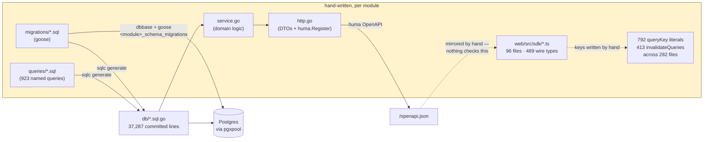
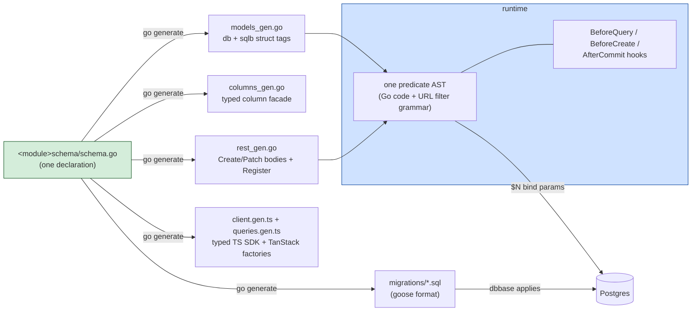
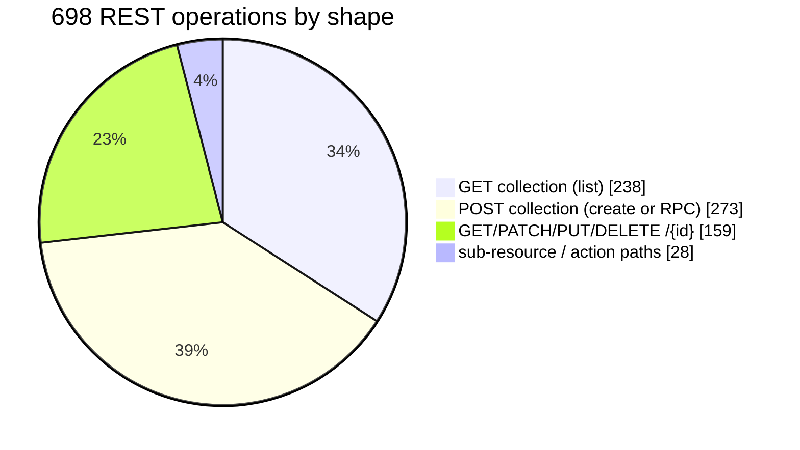
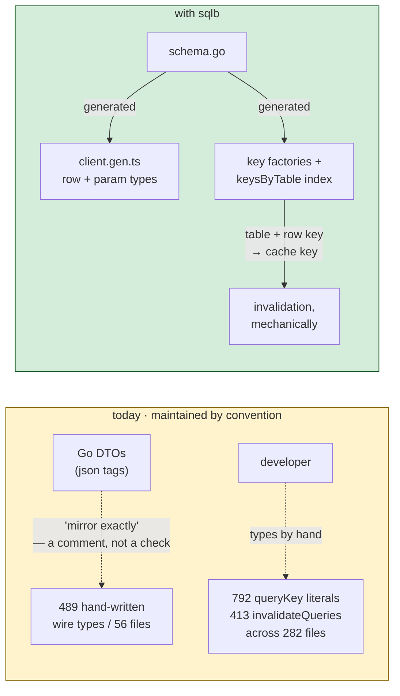
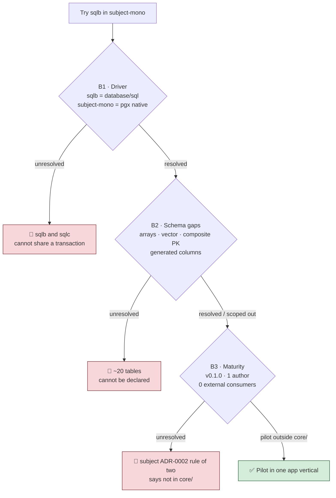
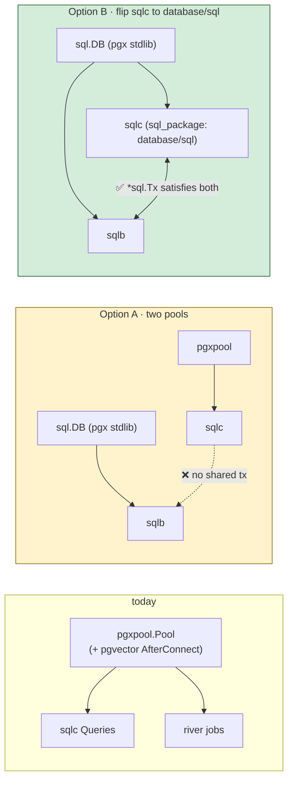
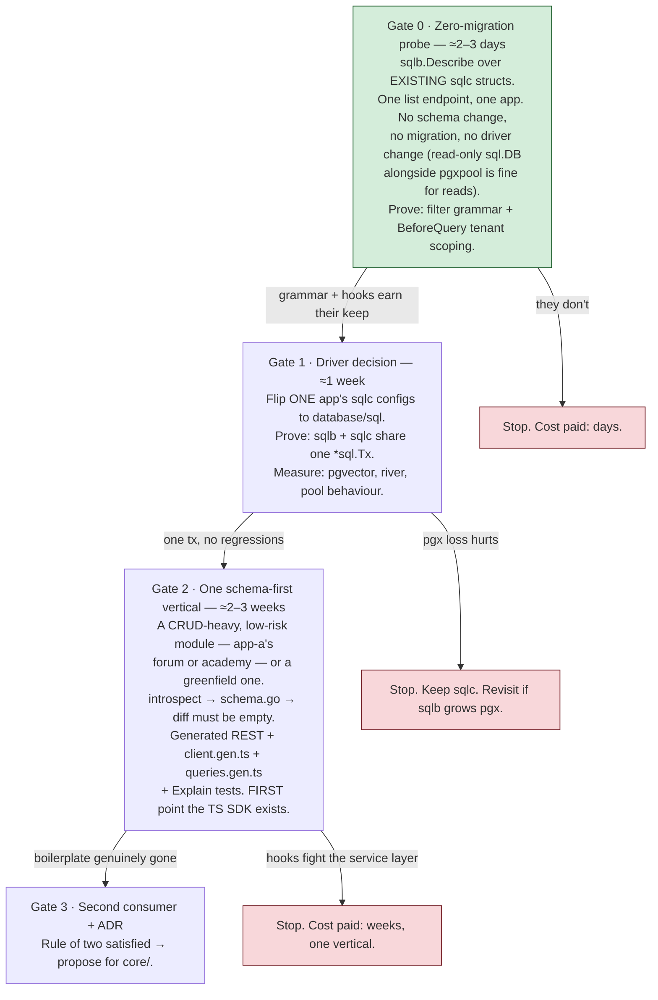

# Review — adopting sqlb into a multi-app monorepo  (2026-07-29)

The second outside evaluation of sqlb, and the first against a repository
holding *many* applications rather than one: ten products in one tree sharing a
`core/` platform layer, 213 tables, 923 sqlc queries, 748 route registrations
and ten web front-ends. The question asked was whether sqlb could replace its
CLI, REST and sqlc layers, with backward compatibility explicitly waived.

**The subject is anonymised.** It is called `subject-mono` throughout and its
products are `app-a` … `app-i`. Nothing technical was removed: every count,
every layer, every path inside the platform and every finding is as written.
What is gone is the identity, for the same reason as in
[the first evaluation](review-adoption-existing-app.md) — the shape of the
codebase is what the findings are about, and that shape is a common one.

It is a different codebase from that one rather than a second draft of it: a
different evaluator, a different tree, and one conclusion they reach
independently and by different routes (`database/sql`).

Read it as a snapshot of one evaluator's judgement at `cc312aa`, re-checked
against `main` at `faeddca` on 2026-07-29. Where a finding names a file or a
behaviour it was checked against the code; where it is a judgement call, it says
so. It is an evaluation, not a decision — the input to one.

> **Four findings are already stale, and all four moved in sqlb's favour.** The
> evaluation was written against `cc312aa`; four commits landed behind it.
>
> - **§2's second reading of "CLI", §4.6, and upstream ask 4 — "sqlb emits no Go
>   client".** [ADR-0029](adr/0029-go-cli.md) is *Working*: `codegen.Options.CLIDir`
>   emits a cobra command-line client into the consuming repository, depending on
>   cobra and nothing else, speaking HTTP so it holds no database credential.
>   §4.6's "this layer gets *no* generator" is the sentence that no longer holds,
>   and `admin-cli` is close to what it emits. What the TypeScript client puts in
>   the type system, the CLI puts in `--help` — the operators a column accepts
>   are in the usage string.
> - **§4.6's toolchain cost — a per-module `gen/main.go` run by `go generate`.**
>   [ADR-0032](adr/0032-sqlb-command.md) shipped `sqlb generate`, `sqlb check`
>   and `sqlb migrate`, so the hand-written generator main the section budgets
>   for is no longer written at all. R1 gets cheaper by exactly that much.
> - **§4.4's "single most dangerous footgun", and kill criterion 2.**
>   [ADR-0030](adr/0030-declared-scope-is-required.md) landed: a column declared
>   `Scoped()` is an obligation, and `rest.Resource` refuses to mount a resource
>   whose exposed operations have no matching hook. `schema.Validate` also
>   rejects a `Scoped` column that is not `ReadOnly`, or that is `Nullable`. So
>   "can `BeforeQuery` be made to fail closed in our fx wiring" is answered at
>   startup rather than by wiring discipline. **The `?expand` half is not
>   closed** — ADR-0030 records it under Consequences — so §9.2's advice stands
>   unchanged, and sqlb's own record reaches the same fix (the composite foreign
>   key) by the same reasoning.
> - **§8's row for the generated client.** [ADR-0031](adr/0031-dart-client.md)
>   adds a Dart emitter alongside the TypeScript one. `subject-mono` has no
>   Flutter consumer, so this changes the row and not the recommendation.
>
> **One clarification, which is not a staleness note.** §5.2 counts composite
> primary keys among the blockers, and §9.2 prescribes a composite foreign key
> for the boundary an `?expand` can cross. Those are separable. A composite FK
> needs a composite *unique index* covering the referenced columns, which the DSL
> expresses — `UniqueIndex("workspace_id", "id")` — and the two-column `FOREIGN
> KEY` itself is written by hand in the migration.
> [`example/tasks/taskschema/schema.go`](../example/tasks/taskschema/schema.go)
> documents that split in place. So §9.2 is implementable today at the cost of
> one hand-written migration; the composite-PK gap in §5.2 is real, and separate.
>
> **Everything the verdict rests on was re-checked at `faeddca` and holds.**
> `Executor` is still `QueryContext`/`ExecContext` over `*sql.Rows`; there are
> fourteen column types and none of them is an array or a vector; at most one
> `PrimaryKey()` is allowed, with the error text itself suggesting
> `UniqueIndex`; `rest.Options` has no `Security` field; `?expand` resolves one
> level; and `huma v2.39.0` / `chi v5.3.1` match `go.mod` exactly.
>
> **Upstream ask 1 has since been answered**, in the form the evaluation asked
> for as its fallback: [compatibility.md](compatibility.md#the-driver) now states
> that `database/sql` is the contract, that pgx works through `stdlib` (and is
> what sqlb's own Postgres suite runs on), what that costs, and what would change
> it. The recommendation not to look for a pgx path stands; it no longer has to
> be inferred from a comment.

**On ADR numbers.** `subject-mono` keeps its own numbered ADRs and the ranges
collide — its ADR-0002 is the rule of two, sqlb's is that queries are values.
Every reference below to one of `subject-mono`'s reads `subject ADR-000N`; a
bare `ADR-000N` is sqlb's own and links into [`adr/`](adr/).

---

## 1. Verdict in one paragraph

**Feasible as a *partial* replacement, not as a wholesale one — and not yet.**
The architectural fit is unusually good: sqlb's module registries, `ExternalRef`
(a cross-module reference with a column and an index but *no* foreign key),
goose output and huma mounting line up almost exactly with rules `subject-mono`
already enforces. Roughly **69% of its 923 sqlc queries** are single-table
shapes sqlb's builder expresses directly, and the **238 list endpoints** are
precisely the boilerplate sqlb exists to delete. But three things block a trial
today, in descending order of severity: (1) sqlb speaks `database/sql` and
`subject-mono` is pgx-native everywhere, which makes *sharing a transaction
between sqlb and sqlc impossible* without one side changing; (2) sqlb cannot
express arrays, `vector`, or composite primary keys, which the schema uses in
15–20 places; (3) it is a one-author, zero-consumer library at `v0.1.0`, and
adopting it into `core/` is a platform-wide bet that subject ADR-0002's rule of
two would ask hard questions about.

The **strongest argument for paying those costs is the newest part of the
library**: the TypeScript SDK generator, which is newer than sqlb's own
architecture doc. It is generated from the schema rather than from the OpenAPI
document, so `where` admits only filterable columns with the operators their
type accepts, `select` narrows the *response* type, and hidden columns have no
spelling at all — none of which an OpenAPI-driven generator can express. Set
against `subject-mono`'s 489 hand-maintained wire types, 792 hand-written
`queryKey` literals and 413 `invalidateQueries` calls, that is the biggest
concentration of convention-enforced drift in the repo (§4.5). It is not
independently adoptable — it sits downstream of the schema-first Go work — but
it changes the payoff at the end of the chain.

The right first move is still a **zero-migration pilot** on one list endpoint
using `sqlb.Describe` over the *existing* sqlc structs — that tests the thesis
without touching the schema, the driver, or a single migration.
**§9 is the decision-ready recommendation list**; §7 is the sequencing behind it.

---

## 2. What "CLI, REST, sqlc" means here — the census

"CLI" is ambiguous in this tree, so all three readings are covered below. First,
what is actually on the table:

| Layer | Files | Lines | Notes |
|---|---:|---:|---|
| sqlc generated (`db/*.sql.go`, `models.go`) | 292 | **37,287** | committed, gated by `sqlc diff` in CI |
| Hand-written `queries/*.sql` | 142 | 6,321 | **923 named queries** across ~74 sqlc configs |
| `migrations/*.sql` | 165 | 6,430 | 213 `CREATE TABLE`, goose, per-module tracking tables |
| REST handlers (`http.go`) | 114 | **33,732** | **748 `huma.Register` calls / 698 parseable operations** |
| Service layer (`service.go`) | 82 | 29,113 | the domain seam sqlb would push into hooks |
| Hand-written web SDKs (`web/src/sdk/*.ts`) | 96 | 13,825 | + 23 test files / 5,362 lines. **489 hand-maintained wire types**; see §4.5 |
| React Query call sites | 282 files | — | **792 `queryKey:` literals, 413 `invalidateQueries`** — all hand-written |

The three readings of "CLI":

1. **The generation toolchain** — `mise run sqlc`, `sqlc diff`, goose. sqlb
   replaces this with `go generate` over a codegen main + `migrate.Write`.
   *This one is squarely in scope.*
2. **Admin/ops CLIs** — `admin-cli` (376 lines, cobra + resty, read-only HTTPS
   client over the admin REST API). sqlb generates a **TypeScript** client
   (§4.5), not a Go one, so this layer gets *no* generator — but it would get a
   uniform filter grammar to talk to, and the encoder the TS client already
   contains is the part a Go emitter would mirror. *Partially in scope.*
   [Stale — see the banner above: the Go emitter exists.]
3. **Code-first product CLIs** — the two built on `core/codefirst/clikit`
   (push/pull/dev/validate over source folders). These have nothing to do with
   the data layer. *Out of scope — sqlb does not touch them, and sqlb itself
   ships no CLI ("not built yet" per its README).* [Also stale: `sqlb` is a
   command now — ADR-0032 — though the conclusion that these CLIs are out of
   scope is unaffected.]

---

## 3. The two pipelines side by side

### What a persistent module looks like today



Six hand-written artefacts per module, five of which restate the same table —
and the two dashed edges are the ones no tool verifies. `app-a`'s `types.ts`
states the contract as a comment: *"Field names mirror the Go DTOs' json tags
exactly."* `app-f`'s equivalent opens by declaring twelve of its own interfaces
**STALE**, kept until the call sites adapt. That is the failure mode, written
down by the team, in the file it happens in.

### What sqlb proposes



The TypeScript files are emitted only for tables declaring `Expose(...)`, which
is why they sit at the far end of that fan-out rather than beside it — see §4.5.

The load-bearing idea is that **the URL filter grammar and hand-written Go
compile to the same predicate AST**, so a `BeforeQuery` hook that scopes by
tenant applies to generated handlers and hand-written queries alike. Nothing in
`subject-mono`'s stack does this today — tenant scoping is remembered at each
call site.

---

## 4. Layer-by-layer fit

### 4.1 Schema + migrations — **strong fit** ✅

The DDL is remarkably plain, which is exactly what a schema DSL needs:

| Construct | Occurrences | sqlb support |
|---|---:|---|
| `CREATE TABLE` | 213 | ✅ `schema.Table` |
| `jsonb` columns | 115 | ✅ `schema.JSON` → `json.RawMessage` |
| `REFERENCES` / FK | 157 | ✅ `Ref` (intra-module) |
| `ON DELETE CASCADE` | 116 | ✅ `.OnDelete(schema.Cascade)` |
| `CREATE INDEX` | 299 | ✅ incl. `CONCURRENTLY` staging |
| partial indexes (`WHERE`) | 44 | ✅ `AddIndex{Where: …}` |
| `CHECK` constraints | 58 | ✅ `.Check(name, expr)` |
| `CREATE TYPE` (pg enum) | **0** | ✅ n/a — sqlb uses text + CHECK, same as here |
| views / matviews | **0** | ✅ n/a |
| **composite primary keys** | **26** (15 files) | ❌ at most one `PrimaryKey()` column |
| **array columns** (`text[]` etc.) | **9** (8 files) | ❌ no array type — but **concentrated**: 5 of the 6 affected table structs are `app-d`'s, so most apps are unaffected (§7) |
| **`vector`** (pgvector, `core/rag`) | 1 | ❌ [ADR-0026](adr/0026-vectors-declare-their-index.md) is *Exploring, nothing built*; `introspect` refuses the column |
| `GENERATED` columns | 10 | ❌ no DSL spelling |
| gin/gist indexes | 3 | ⚠️ `AddIndex{Method: "gin"}` renders, but no opclass/`WITH` |
| function + trigger | 1 each | ❌ stays hand-written |
| data backfills in migrations | 12 | ❌ by design — `Diff` emits DDL only |

Two structural rules of `subject-mono`'s map *directly* onto sqlb primitives,
which is the single most encouraging finding in this evaluation:

- **"No cross-module foreign keys"** (the subject's `architecture.md`) →
  `schema.ExternalRef("tenant", "tenants.id")`, which emits the column and an
  index but no constraint, and refuses to be `Expandable` because expanding it
  would reach a table the module does not own. That is the rule, enforced by a
  type system instead of by review.
- **Per-module migration tracking** (`<module>_schema_migrations`) → sqlb's
  `migrate` package **renders goose files and deliberately does not apply them**.
  `dbbase.runMigrations` keeps its job unchanged. No conflict at all.

Adoption of an *existing* module is a closed loop sqlb already supports:
`introspect.Registry` reads `pg_catalog` → `codegen.RenderSchema` writes
`schema.go` → `migrate.Diff` against the live DB must come back empty. That is a
real, testable gate — except for the ~20 tables using arrays, vectors, composite
PKs or generated columns, where `introspect` will drop the column or refuse.

### 4.2 sqlc / query layer — **coexistence, not replacement** ⚠️

All 923 named queries, classified by SQL feature:

| Feature | Queries | % | Where it goes under sqlb |
|---|---:|---:|---|
| **no complex construct** (single-table CRUD shape) | **644** | 69% | ✅ sqlb builder |
| `RETURNING` | 254 | 27% | ✅ `Insert`/`Update` return rows |
| GROUP BY / aggregate | 90 | 10% | ⚠️ `GroupBy`/`Having` + `Collect[R]`, or stays sqlc |
| JOIN | 88 | 10% | ⚠️ manual `Join(table, alias, on)` — table name is a *string* |
| CASE / COALESCE / NULLIF | 68 | 7% | ⚠️ `Coalesce`, else `Raw` |
| `ON CONFLICT` upsert | 47 | 5% | ✅ `OnConflictDoNothing` / `OnConflictUpdate` |
| CTE (`WITH`) | 37 | 4% | ❌ documented non-goal → sqlc or `Raw` |
| arrays / `= ANY` / unnest | 19 | 2% | ❌ no array support |
| subquery in WHERE (`EXISTS`) | 14 | 2% | ❌ `RawPred` |
| jsonb operators | 11 | 1% | ❌ `Raw` |
| LATERAL | 6 | <1% | ❌ `Raw` |
| `FOR UPDATE` | 3 | <1% | ✅ `ForUpdate()`/`SkipLocked()` |
| window functions (`OVER`) | **0** | 0% | ✅ nothing to port |
| pgvector `<=>` | 1 | <1% | ❌ works via `Raw`, but *sequentially scans* — see [ADR-0026](adr/0026-vectors-declare-their-index.md) |

sqlb's own docs are honest about this and draw the line in the same place this
team would: [with-sqlc.md](with-sqlc.md) says *"sqlb owns the CRUD and list
surface, sqlc owns the dashboard and the reports."* Its own adoption review
concludes **"'over sqlc' is the wrong axis."**

So the realistic target is not deleting 37,287 lines of generated sqlc — it is
deleting maybe **60–70% of them** and keeping the rest. Which raises the blocker
in §5.1: the two halves must be able to share a transaction, and today they
cannot.

### 4.3 REST — **the biggest win, but smaller than the endpoint count suggests** ⚠️

Of 698 operations with a parseable method + path:



- **159 item-CRUD operations + 238 list operations** are the shapes
  `rest.Resource[T, C, U]` serves out of the box. That is the target.
- Of the **273 POST-to-collection** operations, at least **72** are unmistakably
  RPC (`/login`, `/impersonate`, `/deploy`, `/retry`, `/sync`, `/checkout`,
  `/webhook`…). Those stay hand-written — which sqlb supports fine; its own
  `example/tasks` mounts six generated resources beside six hand-written
  endpoints on one router and one OpenAPI document.
- **The dampener:** only **204 query-param struct tags across 54 files** exist in
  the whole repo, dominated by `limit` (47) and `offset` (44), with `search`
  appearing 13 times and `sort` **twice**. These list endpoints are mostly *not*
  richly filterable today. sqlb would not merely delete that code — it would
  hand every list endpoint a filter/sort/search/keyset-paging surface it does not
  currently have. That is a genuine capability gain, but it is a **feature
  addition wearing the costume of a refactor**, and it should be costed as one.
  The 13,825 lines of hand-written TS SDK all consume the old shapes — though
  §4.5 is the reason that bill is smaller than it looks: the replacement is
  generated, not retyped.

Mounting is compatible with `httpkit`: `rest.Resource` takes a `huma.API`, not a
router, so `httpkit.NewProtectedAPI`'s chi middleware chain, path base and schema
registry keep working. sqlb wants huma `v2.39.0` / chi `v5.3.1`; `subject-mono`
is on `v2.38.0` / `v5.3.0` — a trivial bump.

### 4.4 The domain seam — hooks vs. the service layer ✅ with caveats

Today: 29,113 lines of `service.go` sit between handlers and sqlc, and publish to
`core/events`. Under sqlb, generated handlers call the builder directly, so
domain logic moves into hooks:

| Existing concept | sqlb equivalent | Fit |
|---|---|---|
| `tenancy.Require(ctx)` at each call site | `BeforeQuery` hook, once per model | ✅ strictly better — fails closed, covers generated *and* hand-written reads |
| `events.Publish` after a write | `AfterCommit(ctx, fn)` | ✅ runs after `COMMIT`, outside the tx |
| `audit` / `activity` subscribers | unchanged (still on the existing bus) | ✅ |
| read-only columns (`tenant_id`) | `.ReadOnly()` + `BeforeCreate` stamps it | ✅ the column has no spelling in any request body |
| `invalidations`, `jobs` (river) | unchanged | ✅ river keeps its own pgxpool |

Three sharp edges worth writing down:

- **Hooks do not follow an `?expand` join.** A `BeforeQuery` on the target model
  does not run for an expansion. Where a tenant boundary must hold across a
  relation, *the schema* has to enforce it (composite FK), not the hook. For a
  multi-tenant platform this is the single most dangerous footgun in the library.
- `Describe` **panics** if called after the first statement is built → it must
  run in an `fx.Invoke` ordered before anything queries. The fx graph makes that
  expressible, but it is a new ordering constraint.
- `sqlb.On[T]()` writes to a **process-global** registry keyed by Go type. Fine
  for one binary per app; in parallel tests use `NewRegistry()` +
  `DB.WithHooks()` or suites will leak hooks into each other.

### 4.5 TypeScript SDK generation — **the strongest single pull factor** ✅

This landed in sqlb's most recent commit at the time of writing and is newer
than its own `architecture.md`, which still says "client not built". It is
materially more than a fetch wrapper, and it changes the cost/benefit of the
whole schema-first path.

`codegen.Options.TSDir` emits two files into the consuming repository — the way
`models_gen.go` is emitted — so there is no npm package and **no way for the
client to be a version behind the server**. `codegen.Check` covers both, so a
`sqlc-check`-style drift gate extends to the frontend:

| File | Contents | Deps |
|---|---|---|
| `client.gen.ts` | row types, request bodies, the typed parameter vocabulary, the filter-grammar URL encoder, one function per exposed operation, typed RFC 9457 problem bodies, cache-key factories | **imports nothing** |
| `queries.gen.ts` | TanStack Query `queryOptions` + `infiniteQueryOptions`, one factory per resource | `@tanstack/react-query` peer |

What the generated types know, that a hand-written client cannot:

- **`where` admits filterable columns only, with the operator set narrowed by
  column type.** `contains` on a number does not compile; nor `isnull` on a
  non-nullable column; nor an enum value outside the declared set.
- **`select` narrows the response type** — after `select: ['title','status']`,
  `items[0].body` is not merely undefined, it does not exist.
- **Hidden columns have no spelling anywhere** — not in the row type, not in
  `select`, not in `where`.
- **Rejections keep their allow-list.** `allowedFor(problem, 'query.sort')`
  returns the sortable columns, so a UI can offer the alternatives instead of
  printing a dead end.
- Refusals are asserted with `@ts-expect-error` in `example/tasks/web`, so a
  generator that *widened* a type fails the build.

Why this matters more here than the endpoint count suggested:



`app-a`'s `web/src/sdk/types.ts` opens with *"Field names mirror the Go DTOs'
json tags exactly"* — a convention enforced by nobody. There are **489 such
types across 56 files**. Separately, **792 hand-written `queryKey` literals and
413 `invalidateQueries` calls** across 282 files are exactly the drift class
sqlb's `keysByTable` index targets;
[ADR-0028](adr/0028-typescript-client.md) cites the motivating bug as
`['draft', id]` against `['drafts', id]` in a client where mutations and an
event stream each kept their own list. `subject-mono` has 413 opportunities for
that bug.

**7 of the 10 web apps already run TanStack Query** (`app-a`, `app-b`, `app-d`,
`app-e`, `app-f`, `app-g`, `app-i`), so `queries.gen.ts` lands on the stack
already in use rather than importing a new one. Note also that
`useInfiniteQuery` appears **once** in the entire repo — the generated
`.infinite()` factory over `next_cursor` is a capability the team effectively
does not have.

**Two limits, both important:**

1. **It is not independently adoptable.** The generator reads a
   `schema.Registry` and emits only for tables carrying `Expose(...)`. It sits at
   the *end* of the chain — `schema.go → Expose → rest.Resource → client.gen.ts`
   — so it cannot be piloted before the Go-side work. It raises the payoff of
   Gate 2; it cannot substitute for it.
2. **It covers generated resources only.** The ~72+ RPC endpoints (`/login`,
   `/deploy`, `/checkout`…) get nothing — the guide says so directly: *"a login
   endpoint is not a table."* Every app SDK stays a hybrid of generated and
   hand-written, which is fine, but it means the 13,825 lines do not go to zero.

The transport is injected (base URL, auth header, refresh, 401 handling stay the
application's), which maps cleanly onto the existing single-flight refresh logic
in the shared API client — that code survives as the `Transport` function.

### 4.6 The CLI layers

- **Toolchain CLI (in scope):** `sqlc generate` / `sqlc diff` / goose-by-hand
  → a per-module `gen/main.go` run by `go generate`, plus `codegen.Check` as the
  CI drift gate (a direct analogue of `mise run sqlc-check`). This is a *wash* in
  effort and a small win in coherence. [Stale — [ADR-0032](adr/0032-sqlb-command.md):
  the `gen/main.go` is not written at all now.]
- **Admin CLIs (partly in scope):** `admin-cli` and friends would gain a
  uniform filter grammar (`?status=eq.new&sort=-created_at&cursor=…`) instead of
  bespoke params per app, but sqlb **emits no Go client**, so the cobra/resty
  layer stays hand-written. If the team wants the generator symmetry, that is an
  upstream ask (§6). [Stale — [ADR-0029](adr/0029-go-cli.md) emits exactly this.]
- **Code-first CLIs — untouched.** `clikit` is about source folders, not rows.

---

## 5. Blockers — what must change before a trial is possible



### 5.1 B1 — the driver mismatch is the real blocker 🛑

```go
// sqlb/exec.go
type Executor interface {
	QueryContext(ctx, query string, args ...any) (*sql.Rows, error)   // ← *sql.Rows
	ExecContext(ctx, query string, args ...any) (sql.Result, error)
}
```

```go
// subject-mono's sqlc output — every one of ~74 modules
type DBTX interface {
	Exec(ctx, string, ...any) (pgconn.CommandTag, error)
	Query(ctx, string, ...any) (pgx.Rows, error)   // ← pgx.Rows
	QueryRow(ctx, string, ...any) pgx.Row
}
```

`*sql.Rows` is a **concrete struct**, not an interface, so **no adapter can make
pgx satisfy `sqlb.Executor`**. This is not a papercut; it decides the whole
adoption shape:



| Option | What it costs | Verdict |
|---|---|---|
| **A · two pools** | Two connection pools per app; **a unit of work can never span sqlb and sqlc**. Given §4.2 says 31% of queries stay on sqlc *inside the same modules*, this breaks atomicity where it is needed most. | ❌ not viable beyond a toy pilot |
| **B · flip sqlc to `sql_package: database/sql`** | Regenerate ~74 sqlc configs; `pgx.Rows` → `*sql.Rows`, and the type overrides need re-checking (uuid→`string`, timestamptz→`time.Time`, nullable-text→`*string` should mostly carry). Then `sqlb.DB.Tx()` yields a `*sql.Tx` that satisfies sqlc's `DBTX` — **one transaction, both libraries**, which sqlb documents and tests. Lose pgx-native batching and the `pgvector` `AfterConnect` codec registration path (`core/rag` needs rework). river keeps its own pgxpool regardless. | ✅ the only coherent path |
| **C · sqlb grows a pgx executor** | Upstream change: abstract rows behind an interface. Invasive for sqlb (its scanner is `*sql.Rows`-shaped throughout). | ⚠️ upstream ask, not this team's call |

**This decision comes first. Everything else is downstream of it.**

### 5.2 B2 — schema constructs sqlb cannot express 🛑 (bounded)

- **Composite primary keys (15 files).** sqlb allows *at most one* `PrimaryKey()`
  column and tells you to "use `UniqueIndex` for composite keys" — but a table
  exposed over REST **must** have a primary key to address rows by. So each of
  these tables needs a surrogate `UUIDv7` PK + a unique index. That is a real
  migration with real data, on tables the team chose composite keys for
  deliberately.
- **Arrays (8 files)** — no `text[]`. Workarounds: jsonb, or a join table.
- **pgvector / `core/rag`** — not just unsupported, actively hazardous: the
  query *works* through `Raw` and silently sequential-scans. `introspect` refuses
  vector columns, so `rag` cannot round-trip. **Scope `rag` out entirely.**
- **Generated columns (10)**, the one function + trigger, and **12 data
  backfills** — `migrate.Diff` renders DDL only. Backfills stay hand-written
  goose files interleaved with generated ones. That works (same directory, same
  runner) but the "one declaration is the source of truth" story gets an asterisk.

### 5.3 B3 — maturity vs. the platform rules 🛑

`v0.1.0`, 83 commits, one author, **zero observed consumers** — the library's own
README and its adoption review say so plainly and say elapsed time is what is
missing. Meanwhile:

- Subject ADR-0002 requires ≥2 apps to need a `core/` change, with a Proposed ADR
  first. A dependency this load-bearing in `core/` would be the largest single
  platform bet this team has made.
- The engine dependency budget: sqlb's engine is **stdlib-only** and
  CI-enforced; only `rest` pulls huma, which `subject-mono` already ships. That
  part is genuinely low-risk.
- Its own review's exit criterion is *"six months of someone other than the
  author running it against production traffic."* This team would be that
  someone.

Mitigation: **pilot in one app vertical (`apps/<app>/app/internal/app/...`), not
in `core/`.** The layering rules already allow product-local dependencies that
core does not carry.

### 5.4 Second-order frictions (not blockers, but budget for them)

| # | Friction | Impact |
|---|---|---|
| F1 | `rest.Options` has **no `Security` field** — generated operations carry no OpenAPI security scheme. Auth still works (chi middleware), and the **generated TS client is unaffected** (it is built from the schema, not the document, and takes the auth header from the injected transport). The cost falls on the OpenAPI document and anything driven by it — `/docs`, and agents reading the spec. | Low–medium |
| F2 | Response envelope is sqlb's (`{items, page, per_page, has_more, next_cursor}`) and paging is `?page/per_page/cursor`, not `?limit/offset`. No backward compat needed, but **every consuming frontend changes**. | Medium |
| F3 | Capabilities must be **restated** in `Describe` when adopting over existing sqlc structs (they aren't in the struct). Two sources of truth until a module goes schema-first. | Low |
| F4 | `?expand` resolves **one level only**; no `?expand=list.workspace`. Several nested reads (`app-a`, `app-e`) are two levels. | Low–medium |
| F5 | Column names are **strings** — `F("titel")` compiles and fails at runtime. The mitigation is `Explain`-as-a-test against a live schema, which needs Postgres. The team already runs testcontainers, so this is cheap — but it is a new required test per query shape. | Low |
| F6 | No change feed / outbox. `events` + `audit` + `activity` + `invalidations` already exist, so `AfterCommit` is the seam and the bus stays. | Low |
| F7 | Table naming: `schema.NewModule("billing")` prefixes tables (`billing_invoices`); these tables are unprefixed (`users`, `refresh_tokens`). Either use one registry per module without a prefix, or rename tables via `RenamedFrom`. | Low |
| F8 | sqlb's `migrate` comments out destructive changes, so the checked-in file is not always the SQL that ran — `shadow.Build` then diverges from production wherever one was uncommented by hand. The 12 backfill migrations already put the repo in that territory. | Low |
| F9 | **Wire spelling is snake_case, by design** — the generated client uses the wire names and refuses a mapping layer ("the point of a generated client is that there is nothing there"). The Go DTOs are **1,848 snake_case json tags vs 334 camelCase**, so 85% already matches; the residual 334 (179 of them `app-f`'s, 48 `app-h`, 47 `app-g`) must be renamed on both sides. `app-f` and `app-e` are the camelCase-leaning frontends and the worst pilot targets for that reason. | Low, but it picks the pilot |

---

## 6. What would have to change — on each side

### On subject-mono's side

1. **Decide the driver** (§5.1). Flipping sqlc to `database/sql` is a
   mechanical but repo-wide change (~74 configs, 37k regenerated lines, plus
   `core/rag`'s pgvector registration). Do this behind its own PR and CI gate,
   *before* any sqlb code lands.
2. **Give composite-PK tables a surrogate key** (15 files) — or exclude them.
3. **Scope out `core/rag`** and anything array-shaped.
4. **Add a layer rank for the schema DSL.** `schema` is design-time and imported
   by nothing at runtime, which the layering check must be taught.
5. **Write a Proposed ADR** before any `core/` adoption (subject ADR-0002).
6. **Budget the frontend move honestly** (F2, F9). The client itself is
   *generated*, so the wire types are not retyped — what stays manual is the
   792 hand-written `queryKey` literals and 413 `invalidateQueries` call sites
   that must move onto the generated key factories, plus renaming the 334
   camelCase json tags on any app that adopts. Migrate keys per resource, not in
   one sweep: `keysByTable` makes a partial migration coherent.

### Upstream asks for sqlb (in the order they'd unblock this team)

1. **A pgx path** — or an explicit statement that `database/sql` is the contract,
   so we stop looking for one. (Today: the honest answer is "flip sqlc".)
   [Answered — [compatibility.md](compatibility.md#the-driver).]
2. **`Security` on `rest.Options`**, so generated operations carry their auth
   scheme into the OpenAPI document (the TS client does not need it — it never
   reads the document).
3. **Array columns** — the cheapest of the schema gaps and the one with 8 real
   call sites here. [Shape recorded in [ADR-0033](adr/0033-array-columns.md);
   nothing built. The ask is what prompted it.]
4. **A Go client generator** to match the TypeScript one, for the admin CLIs.
   [Answered — [ADR-0029](adr/0029-go-cli.md).]
5. **Composite primary keys**, or a documented "surrogate key required" stance.
6. pgvector ([ADR-0026](adr/0026-vectors-declare-their-index.md)) — noted, not
   urgent if `rag` is scoped out.

---

## 7. Recommended path — three gates, stop at any of them



**Gate 0 is the whole recommendation.** It costs days, touches no migration and
no driver, and answers the only question that matters: *does one `BeforeQuery`
registration plus a URL filter grammar actually delete more complexity than the
runtime-string-columns trade-off adds?* Everything after Gate 0 is expensive;
nothing before it is.

**Suggested pilot target — `app-a`.** Array columns turn out to be
*concentrated*, not spread: of 158 generated table structs across all apps, only
6 carry a Go slice column, and **5 of those 6 are in `app-d`** — including both
of its headline lists (`/contacts` → `Contact.Tags`, `/conversations` →
`Conversation.Tags`). That rules out the app an earlier draft of this document
would have picked.

| App | Tables | With arrays | camelCase json tags | TanStack | Verdict |
|---|---:|---:|---:|---|---|
| **app-a** | 28 | **0** | 9 (vs 105 snake) | ✅ | ✅ **pilot here** |
| app-b | 10 | 0 | 9 | ✅ | ✅ viable, smaller surface |
| app-c | 5 | 0 | 4 | — | ⚠️ small; no web SDK to prove §4.5 |
| app-d | 9 | **5** | 5 | ✅ | ❌ arrays hit both main lists |
| app-e | 29 | 0 | 27 | ✅ | ⚠️ camelCase-leaning (F9) |
| app-f | 42 | 0 | **179** | ✅ | ❌ worst F9 exposure; 6,441-line SDK |

**The concrete Gate 0 target: `GET /forum/threads`.** `forum.ForumThread` is
eight plain columns, no arrays, tenant-scoped by `company_id`, and its list query
is a bare `SELECT … WHERE company_id = $1 ORDER BY …` with no filter, no search
and no paging — so the endpoint demonstrates both halves at once: what the filter
grammar adds, and what `BeforeQuery` takes over.

---

## 8. Summary table

| Layer | Replaceable by sqlb? | Confidence | Blocking issue |
|---|---|---|---|
| Migrations / schema | **Mostly** (≈90% of tables) | High | composite PKs, arrays, vector |
| sqlc queries | **Partially** (≈69%) | High | must coexist → driver mismatch |
| REST list + item CRUD | **Yes** (≈397 of 698 ops) | Medium | response shape + auth in OpenAPI |
| REST RPC endpoints (≈72+) | **No** — by design | High | none; they mount alongside |
| Service layer | **Partially** → hooks | Medium | expand-bypasses-hooks footgun |
| Web SDK (13.8k lines TS, 489 wire types) | **Yes for CRUD/list**, generated + TanStack factories | Medium-high | not independently adoptable — downstream of `Expose` |
| Toolchain CLI (sqlc/goose) | **Yes** | High | none |
| Admin CLIs (`admin-cli`) | **No generator** | High | no Go client emitter [stale — ADR-0029] |
| Code-first CLIs | **Out of scope** | High | — |

**Bottom line:** the design is a genuinely good match for this codebase — better
than expected going in, particularly `ExternalRef` and the goose-render-but-
don't-apply split, which read as if they were written against the subject's
architecture doc — and the TS SDK generator is the part most likely to pay for
the rest, because it attacks drift that nothing in the current stack even checks
for. What stands between this team and a trial is not design, it is **one driver
decision, twenty-odd tables, and a library that no one but its author has run in
production.** Gate 0 costs days and settles the first question. Take that step;
defer the rest.

---

## 9. Recommendations

§6 lists what would have to change and §7 sequences it. This section is the
decision-ready form: what to do, in what order, and what would make the team
stop.

### 9.1 Do these

| # | Recommendation | Effort | Depends on |
|---|---|---|---|
| **R1** | **Run Gate 0 against `GET /forum/threads`** in `app-a`. `sqlb.Describe[db.ForumThread]()` over the *existing* sqlc struct — `PrimaryKey("id")`, `Filterable("status")`, `Sortable("created_at","title")`, `Searchable("title")` — plus one `BeforeQuery` hook stamping `company_id` from context. Mount one `rest.Resource` beside the existing handler; do not delete the old one. | ≈2–3 days | nothing |
| **R2** | **Write down the Gate 0 exit criteria before starting**, not after (§9.3). A pilot without a stated kill condition becomes a sunk cost. | ≈1 hour | — |
| **R3** | **Decide the driver question explicitly** (§5.1) and record it, whichever way it goes. Flipping sqlc to `sql_package: database/sql` is the only path that lets sqlb and sqlc share a transaction; two pools is not a viable end state. Do it as its own PR with `sqlc diff` green, in **one app first**, never repo-wide. | ≈1 week | R1 passing |
| **R4** | **Raise the two upstream asks that block structurally** — a pgx path (or a clear "database/sql is the contract") and array columns. Both are cheap for the author to answer and change the sequencing materially. | ≈1 hour | — |
| **R5** | **Keep `core/rag` and every array-carrying table out of scope**, permanently for now. pgvector on sqlb is not merely absent — the `Raw` path *works* and sequentially scans, which is the failure mode that looks like success. | — | — |
| **R6** | **If Gate 2 is reached, adopt the TS SDK generator on the same vertical in the same PR.** Its payoff (§4.5) is the strongest argument for the whole exercise, and it cannot be evaluated separately — it emits only for tables carrying `Expose(...)`. | included in Gate 2 | Gate 2 |
| **R7** | **Migrate query keys per resource, never in one sweep.** `keysByTable` makes a partial migration coherent, so the 792 `queryKey` literals and 413 `invalidateQueries` calls move incrementally rather than as a flag day. | ongoing | R6 |
| **R8** | **Write the Proposed ADR before any `core/` adoption**, per subject ADR-0002. Product-local adoption needs no ADR; `core/` does, and the rule of two is not satisfied by one pilot. | ≈half a day | Gate 3 |

### 9.2 Do *not* do these

- **Do not start with the driver flip.** It is the largest mechanical change in
  the plan and it proves nothing on its own. R1 costs days and can make it moot.
- **Do not pilot in `app-f`.** 179 camelCase json tags (F9) and a 6,441-line
  hand-written SDK make it the most expensive place to learn a cheap lesson —
  and the one whose `types.ts` already documents its own drift.
- **Do not pilot in `app-d`** despite its clean naming and absent SDK: 5 of its
  9 tables carry array columns, including both headline lists.
- **Do not put sqlb in `core/` before a second consumer exists.** The engine is
  stdlib-only and the dependency risk is genuinely low, but the *coupling* risk
  is not: 12 apps would inherit the bet at once.
- **Do not rely on `BeforeQuery` for a boundary that an `?expand` can cross.**
  Hooks do not follow the join (§4.4). Where a tenant boundary must hold across a
  relation, enforce it in the schema with a composite foreign key.
- **Do not delete the endpoint the pilot shadows** until the generated one has
  served real traffic. Both can be mounted on the same huma API.
- **Do not treat "the boilerplate disappears" as the success measure.** These
  list endpoints are thin today (204 query-param tags repo-wide, `sort` appearing
  twice). The gain is mostly *capability* and *drift elimination*, not deletion —
  and it should be judged as such.

### 9.3 Kill criteria — state these before Gate 0, not after

Gate 0 fails, and the team stops, if any of these hold after the probe:

1. The `Describe` + hook registration is not **materially shorter** than the
   handler + service + query it replaces, once the `Explain` tests that
   substitute for compile-time column checking are counted in.
2. Tenant scoping through `BeforeQuery` cannot be made to **fail closed** in the
   fx wiring — a missing `company_id` must error, never silently widen a query.
3. The runtime-string-column trade-off produces a defect the type system would
   have caught, *during the pilot itself*.
4. `filter.Parse` rejections cannot be mapped onto the existing error envelope
   without a translation layer larger than the handler it replaced.

Gate 1 fails if the `database/sql` flip degrades pgvector, river or pool
behaviour measurably. Gate 2 fails if hooks and the service layer end up
duplicating domain logic rather than one absorbing the other.

### 9.4 What would change the verdict

The design is not what holds this back — sqlb's own review says the clock is, and
this evaluation agrees. Three things would move it from "pilot" to "adopt":

- **Elapsed time under someone else's traffic.** This team would be the first
  consumer. A second, unrelated adopter changes the risk profile more than any
  feature.
- **A pgx path**, which would remove the single largest mechanical cost (R3) and
  make incremental adoption per-module rather than per-app.
- **Array columns**, which would take the schema-gap objection from "20 tables"
  to "the vector column in `rag`."

Absent those, the recommendation stands as: **run R1, hold everything else.**

---

## Appendix — how the numbers were produced

All counts are from the evaluated snapshot, computed by walking the tree:

- **Queries**: every `*.sql` under a `queries/` directory, split on
  `-- name: X :kind` → 923 queries in 142 files. Feature classification by regex
  over each query body; "no complex construct" excludes `RETURNING`, bare casts
  and `sqlc.arg` from the complexity signal.
- **REST operations**: `huma.Operation{…}` literals with both a `Method:` and a
  `Path:` → 698 of the 748 `huma.Register` calls (the rest build the operation
  indirectly). Shape classification by method + whether the last path segment is
  a `{param}`.
- **DDL**: regex counts over every `*.sql` under a `migrations/` directory
  (165 files).
- **LOC**: line counts over the file sets named in §2.
- **Frontend**: `.ts`/`.tsx` under any path containing `/sdk` (96 source files,
  13,825 lines; 23 test files excluded from that count), `export interface|type`
  declarations within them (489), and repo-wide counts of `queryKey:` (792),
  `invalidateQueries` (413), `useQuery(` (342), `useMutation(` (310) and
  `useInfiniteQuery(` (1) across 282 files. TanStack Query presence read from
  each app's `web/package.json` — 7 of 10.
- **Wire naming**: `json:"…"` tags across all non-test Go files — 1,848
  snake_case vs 334 camelCase, attributed per app. The parallel count of
  camelCase property declarations in SDK `.ts` files (1,532) is *indicative
  only*: the regex matches any indented `prop:` declaration, so it catches local
  view models alongside wire shapes. The Go tag counts are the ground truth, and
  they are what F9 is costed against.

sqlb facts are from its source at `v0.1.0`, not from its README:
`exec.go` (`Executor`), `schema/type.go` (the 14 column types — no array, no
vector), `schema/registry.go:243` (single primary key), `rest/rest.go`
(`Options`, no `Security`), `migrate/formats.go` (goose / golang-migrate /
plain), `mutate.go` (`OnConflictUpdate`), `builder.go` (`Join`, `GroupBy`,
`Having`, `ForUpdate` — no CTE, no window functions).

The TypeScript SDK generator was read at `cc312aa`, the repository's HEAD at the
time: `codegen/tsclient.go` (38,662 bytes), its emitted output in
`example/tasks/web/src/api/` (`client.gen.ts` 1,153 lines, `queries.gen.ts` 247
lines), the [TypeScript guide](typescript/README.md) and
[ADR-0028](adr/0028-typescript-client.md). Emission is gated on a table
declaring `Expose(...)` — `codegen/tsclient.go:159` and `:305` skip any table
whose `Rest()` is nil.
